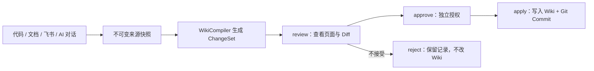
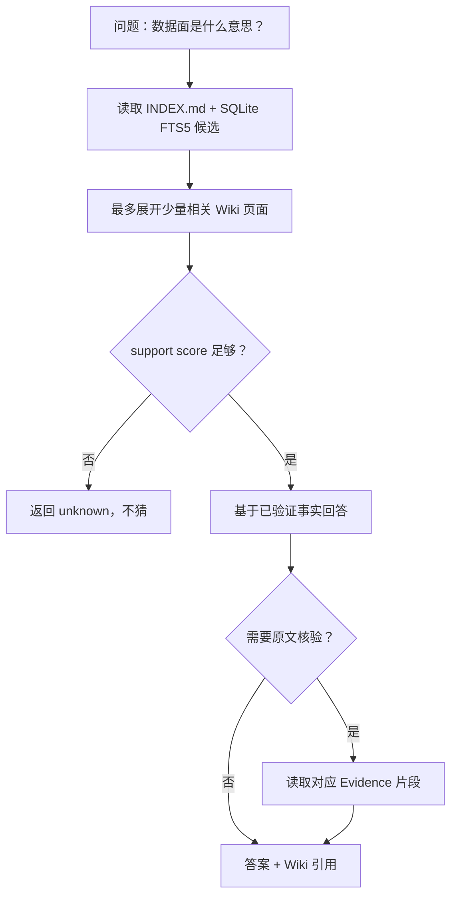
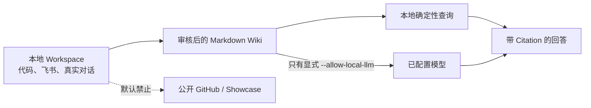
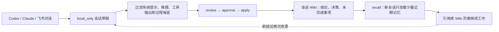

# MemoryForge

<!-- memoryforge-release-claim: version=0.4.0; status=released; supported_platforms=macos; macos_passed=656; linux_status=not_rerun; windows_status=not_verified; release_verification=passed -->

<!-- memoryforge-release-claim: version=0.3.0; status=released; supported_platforms=macos+linux; active_candidate=19; platform_gate_candidate=19; platform_gate_status=accepted; review_status=accepted; macos_passed=642; linux_passed=639; linux_skipped=3; windows_status=not_verified; release_verification=passed -->

> 把散落在代码仓库、设计文档、飞书和 AI 对话里的技术资料，编译成一套可维护、可追溯、可以直接在飞书提问的个人技术 Wiki。

> **v0.4.0 发布范围：macOS。** 完整本地门禁 `656 passed`。Linux 未在本版本重跑；
> Windows 尚未验证。最终状态与 SHA256 以 GitHub Release 为准。

[60 秒演示](#60-秒公开演示) · [5 分钟跑通](#5-分钟跑通) · [飞书接入](#用飞书展示项目) ·
[AI 会话记忆](#ai-会话如何变成长效记忆) · [设计边界](#当前边界)


<p align="center">
  
  
</p>
<p align="center"><sub>v0.4.0 本地只读 Wiki：概览、检索、最近页面、Markdown 阅读器和引用依据。</sub></p>

## 这是什么项目？

写项目久了，最难找的往往不是代码，而是“为什么当初这么设计”“这个规则写在哪”“方案为什么被放弃”。这些答案通常散落在 README、`docs/`、ADR、复盘和飞书文档里，而且会持续变化。

**MemoryForge 先把资料和对话沉淀为人也能直接阅读的 Markdown Wiki，再提供带来源的渐进式检索和一个最小 Agent。** 它不是把所有内容直接塞进提示词的聊天机器人，而是一个本地优先的“技术知识编译器”。

运行后，你会得到：

- 一套可直接阅读和 Git 版本化的 Markdown Wiki；
- 每条事实对应的来源版本、原文位置和审核记录；
- CLI、飞书机器人和最小 Agent 三种问答入口；
- AI 换新会话后可按需加载、不会整库灌入上下文的长期记忆。

适合个人开发者、小团队技术负责人、需要整理多个仓库或长期维护项目知识的人。若你要的是公网 SaaS、企业权限平台或不经审核的全自动 RAG，本项目暂不适合。

## 60 秒公开演示

不需要模型 Key、数据库服务或 Web 后台。三步生成可直接打开的只读静态 Showcase：

```bash
python -m pip install -e '.[dev]'
python demo/run_showcase_demo.py \
  --workdir /private/tmp/memoryforge-showcase-demo \
  --output /private/tmp/memoryforge-showcase
open /private/tmp/memoryforge-showcase/index.html
```

如果 Codex 内置浏览器对 `file://` 页面提示“无法加载”，在输出目录启动一个
仅绑定本机的静态服务器，再打开 `http://127.0.0.1:8765/index.html`：

```bash
cd /private/tmp/memoryforge-showcase
/path/to/MemoryForge/.venv/bin/python -m http.server 8765 --bind 127.0.0.1
```

该服务器只读、只监听本机，不会上传 Wiki 内容；终端保持运行即可浏览页面。

它从仓库内固定的 Python、Go、TypeScript 公开夹具开始，真实执行
`import → Code Index → ChangeSet → review → approve → apply → query → showcase`，并展示来源版本、
Wiki 树、Diff、Citation Trace、Benchmark、保留的失败案例、正确拒答和 Mermaid 架构。输出只有
`index.html`、`showcase.json` 和所有权 marker；没有远程脚本或网络请求。

### 它和普通 RAG 的区别

| 普通 RAG | MemoryForge |
| --- | --- |
| 原文切片后直接召回 | 先编译为可读、可审核、可版本化的 Wiki |
| page recall 常被当成回答质量 | 页面路由、事实选择、Answer、Citation 分开评测 |
| 更新直接替换索引 | 先生成 ChangeSet，再 `review → approve → apply` |
| 主题相关就尝试回答 | support score 不足时返回 `unknown` |
| 很难重放一次结论 | Citation 固定到 SourceVersion、locator、Commit 和 SHA256 |

### 当前公开 Evidence

| 结果 | 指标 | 边界 |
| --- | ---: | --- |
| v0.4.0 本地门禁 | macOS **656 passed** | Linux 未在本版本重跑；Windows 未验证 |
| v0.4.0 本地 Wiki Portal | 公开夹具浏览器验收通过 | 无远程脚本、无模型 Key、只读 |
| 三语言 Code Wiki | Symbol / core Relation / Mermaid / Citation 均为 **100%** | 固定公开夹具 |
| AgentSkill-Eval 文档 Wiki | Answer **96.7%**，Citation **100%** | 单一公开仓库 30 题 |
| learn-claude-code support score development | Answer / selective accuracy **100%**，coverage **90%**，risk **0%** | 10 题；confirmation 未运行 |
| Click 外部迁移 | development / holdout Answer **10% / 0%** | 真实负结果，未隐藏 |
| Static Showcase development | **4/4**，本地详情泄漏 **0**，Workspace 变更 **0** | confirmation 未运行 |
| v0.3.0 Candidate 19 development | **6/6**；package/query/privacy/artifact contracts | accepted；静态终审 **0 P0/P1/P2** |
| v0.3.0 本地门禁 | macOS **642 passed**；Linux **639 passed / 3 skipped** | Windows 未验证，不属于支持范围 |
| 历史：v0.3.0 RC Candidate 12 development | macOS **623 passed**；Debian **620 passed / 3 skipped** | 静态终审 rejected；详细记录在 Evidence registry |

## 它解决了什么问题？

| 常见问题 | MemoryForge 的做法 |
| --- | --- |
| 资料散在多个仓库、文档和飞书里 | 将指定资料导入一个本地 Workspace，保留来源与版本 |
| 更换 AI 会话后丢失历史上下文 | 将飞书或 Botmux 托管的 AI 对话保存为 `local_only` 草稿，审核后进入长期 Wiki |
| 文档更新后 Wiki 很容易过期 | 根据来源路由更新受影响页面，不重复生成一堆近似摘要 |
| 问答容易胡编或找不到出处 | 先查目录和少量 Wiki 页面；需要时再回读原文并返回引用 |
| 资料敏感，不适合直接上传 | 默认 `local_only`；是否让模型读取本地资料必须显式授权 |
| 项目只有命令行，不直观 | 生成只读静态 Showcase；飞书保留为可选交互入口 |

## 核心能力

- **多源资料接入**：递归 Folder（Markdown/TXT/HTML）、已克隆 Git 仓库、单个 GitHub Issue/PR Thread、飞书 Docx/Wiki、单篇公开网页或保存的 HTML。
- **对话记忆草稿**：飞书支持手动或逐轮收录；Botmux 托管的 Codex 等会话可通过 Hook 自动收录。内容默认 `local_only`，仍须人工审核后才进入正式 Wiki。
- **WikiCompiler**：将资料编译为“项目/模块介绍、机制说明、方案与复盘”三类 Markdown 页面；每页都保留来源、版本与原文位置。
- **代码 Wiki**：用 Tree-sitter 为显式选择的 Python、Go、TypeScript/TSX 代码构建确定性符号图、模块计划和带引用 Wiki，仍须人工审核后应用；页面按仓库短 ID 分目录，多个仓库的同名模块不会互相覆盖。
- **增量更新**：新资料优先扩展已有主题；资料更新时只重编译受影响的页面。
- **渐进式查询**：`INDEX.md → 少量 Wiki 页面 → 按需原文核验`，避免一次把整个知识库塞进上下文。
- **MiniClaude Agent**：只提供 `search_wiki`、`read_evidence`、`final` 三个工具；必须读取证据后才能给出带引用的答案。
- **飞书展示入口**：`feishu-serve` 直接接收飞书私聊消息，查询本地 Wiki 后回复；可显式启用模型，将命中的证据组织成更自然的回答。
- **模型不可用时可降级**：模型服务超时或临时繁忙时，`ask` 和飞书入口回退到已验证的 Wiki 原文，不让用户一直等待或得到无引用的错误答案。
- **可验证性**：提供 `lint` 检查页面/来源关系，提供 `eval` 用公开题集检查回答、引用与读取成本。
- **只读展示**：`memoryforge showcase build` 生成自包含静态 Evidence 页面；默认隐藏
  `local_only` 来源、页面、ChangeSet 和 Citation 细节。

### 一份资料如何进入正式 Wiki？



生成和授权分开。`watch`、Botmux Hook 或飞书自动收录都只能生成草稿，不能绕过审核直接改正式 Wiki。

## 一次提问是怎么完成的？



这个路径的重点不是“让模型读得越多越好”，而是让每一步都有明确边界：日常查询不读原文，只有 `--verify` 或 Agent 的 `read_evidence` 才展开对应片段。

## 5 分钟跑通

环境要求：Python 3.11+，macOS 或 Linux。

```bash
git clone https://github.com/still0123/MemoryForge.git
cd MemoryForge

python -m venv .venv
source .venv/bin/activate
python -m pip install -e '.[dev]'

# 1. 初始化你的知识库
memoryforge init ./my-wiki

# 2. 导入一份资料
memoryforge import ./notes/cache.md --category design --workspace ./my-wiki

# 3. 先生成变更预览，独立审批后再写入 Wiki
memoryforge ingest --pending --workspace ./my-wiki
memoryforge review <changeset-id> --workspace ./my-wiki
memoryforge approve <changeset-id> --workspace ./my-wiki
memoryforge apply <changeset-id> --workspace ./my-wiki

# 4. 提问
memoryforge ask '缓存多久过期？' --workspace ./my-wiki

# 5. 新 AI 会话加载已审核的近期记忆
memoryforge recall --workspace ./my-wiki
```

生成后的 Workspace 大致如下：

```text
my-wiki/
├── raw/                 # 原始资料快照
├── wiki/
│   ├── INDEX.md         # Wiki 总目录
│   └── pages/           # 稳定的 Markdown Wiki 页面
├── .memoryforge/        # SQLite 索引、来源版本和编译路由
└── .git/                # Wiki 自己的修改历史
```

## 用飞书展示项目

飞书是 MemoryForge 的**展示与交互层**，不是另一个通用 Agent 平台的外壳：

```text
飞书私聊消息 -> memoryforge feishu-serve -> 渐进式 Wiki 查询 -> 带来源回复
```

配置好自建飞书应用和 `lark-cli` 后，在运行项目的机器上启动：

```bash
# 纯本地、确定性回答：不调用模型
memoryforge feishu-serve --workspace ./my-wiki

# 显式允许已配置模型读取“本次命中的本地证据”，生成更自然的回答
memoryforge feishu-serve --llm --allow-local-llm --workspace ./my-wiki
```

飞书服务只处理私聊文本并回复原消息。资料仍要先走 `feishu-import → ingest → review → apply`，它不会自动抓取飞书空间或后台同步全部文档。完整配置见 [FEISHU_MVP_SPEC.md](FEISHU_MVP_SPEC.md)。

### 飞书试跑

先确认本地 Workspace 能回答一个已知问题：

```bash
memoryforge feishu-reply '你的测试问题' --workspace ./my-wiki
```

再用 `lark-cli config init --new` 写入自建应用配置，启动 `feishu-serve`，并私聊机器人同一问题。回复应带 `来源 Wiki：wiki/pages/...`；App Secret 只保留在本机，不提交仓库。

## MiniClaude Agent 在哪里？

MemoryForge 不尝试复刻完整 Claude Code。它实现的是一个围绕 Wiki 内核的最小 Agent：

```text
问题 -> search_wiki -> read_evidence -> final（带引用）
```

```bash
memoryforge agent '缓存多久过期？' --workspace ./my-wiki
```

如果连续追问，可以给 Agent 一个本地 session。它只保留最近 3 轮问题、回答和引用片段，
只用来理解“它/这个方案/那数据面”等追问；每一轮仍然必须重新执行
`search_wiki → read_evidence → final`：

```bash
memoryforge agent '管控面主要做什么？' \
  --session interview \
  --workspace ./my-wiki
memoryforge agent '那数据面呢？' \
  --session interview \
  --workspace ./my-wiki

# 清空一个本地会话
memoryforge agent-clear interview --workspace ./my-wiki
```

会话文件只写入 Workspace 的 `.memoryforge/sessions/`，该目录默认被 `.gitignore` 忽略，
不会进入 Wiki 或 Git 提交。没有传 `--session` 时，Agent 仍保持原来的单轮行为。飞书服务则优先
使用事件里的 `chat_id`（缺失时使用 `open_id`）作为 session；事件没有稳定标识时自动退回单轮。

Agent 没有 Shell、通用写文件、Subagent 或 MCP 工具；它只负责在有限步数内检索、核验和回答。session 由系统写入专用本地目录，不是模型可调用的工具。因此项目的重点始终是 Wiki 编译、来源路由与渐进式查询，而不是堆叠通用 Agent 能力。

## 用公开资料复现

仓库提供了仅基于公开 `AgentSkill-Eval` 文档的 Demo，不需要模型 Key，也不上传资料：

```bash
.venv/bin/python demo/run_public_demo.py \
  --source-repo ~/code/AgentSkill-Eval \
  --workspace /private/tmp/memoryforge-public-demo \
  --output /private/tmp/agent_skill_eval_public.json
```

脚本会真实执行：

```text
init -> git-add --public -> git-sync -> ingest -> review -> approve -> apply -> lint -> ask -> eval
```

已提交的公开结果在 [demo/results/agent_skill_eval_public.json](demo/results/agent_skill_eval_public.json)。`eval` 会检查回答是否命中关键事实、引用是否可回溯，以及每题实际展开了多少 Wiki 页面/原文字符。

脚本也支持重复传入 `--source-repo`，将多个已克隆的公开仓库编译进同一个 Workspace；你的公开个人题集示例和命令见 [多仓库 Demo](demo/README.md#多仓库个人资料演示)。

### 公开对照结果

同一份 30 题公开题集上，MemoryForge 与“直接在原始资料上做 OR + BM25 Top-3”的 Raw FTS 基线结果如下：

| 指标 | MemoryForge | Raw FTS |
| --- | ---: | ---: |
| Top-3 来源召回率 | **96.2%** | 57.7% |
| 多来源完整覆盖率 | **100.0%** | 20.0% |
| 回答准确率 | 96.7% | 不适用 |
| 引用落地准确率 | 100.0% | 不适用 |
| 无答案拒答准确率 | 100.0% | 不适用 |
| 平均证据/候选文本字符数 | 159.2 | 728.0 |

Raw FTS 只负责检索，不生成答案，所以不能拿它计算回答、引用或拒答准确率。完整方法、失败案例和复现说明见 [公开 Benchmark](docs/BENCHMARK.md)。

### 从 Wheel 独立复现

发布检查会创建全新虚拟环境，只安装 Wheel，并运行 CLI、代码 Wiki Benchmark 和可选的完整公开
Demo。脚本会拒绝从源码 checkout 导入 `memoryforge`：

```bash
uv build --wheel --out-dir dist
.venv/bin/python demo/run_release_check.py \
  --wheel dist/memoryforge-0.4.0-py3-none-any.whl \
  --workdir /private/tmp/memoryforge-release-check \
  --output /private/tmp/memoryforge-release-provenance.json \
  --code-evidence-output demo/results/code_wiki_public.json \
  --public-evidence-output demo/results/agent_skill_eval_public.json \
  --public-source-repo /absolute/path/to/AgentSkill-Eval
```

公开仓库必须 checkout 到 `93f5dc05229da250b041850ad8deeeec886ef304`。提交的
[`release_provenance.json`](demo/results/release_provenance.json) 是 v0.2.0 的历史发布证据。
v0.4.0 的实际 import 路径、依赖版本、Wheel/sdist SHA256 和 tag Commit 以 GitHub Release
中的 `release-provenance.json` 与 `SHA256SUMS` 为准。

### 本地零付费门禁

仓库已关闭 GitHub Actions，后续不使用 hosted runner。完整检查、双 clean-room 构建和 SHA256
Evidence 在本机执行：

```bash
./scripts/check_local.sh

# release-candidate 双隔离构建
python scripts/build_release.py \
  --output /private/tmp/memoryforge-v0.4.0-release
```

Windows PowerShell 提供实验性本地检查，但 v0.4.0 未验证 Windows：

```powershell
.\scripts\check_local.ps1
```

产物默认写入被 Git 忽略的 `local-evidence/<UTC timestamp>/`。安装、命名产物和手动发布流程见
[本地免费工具链](docs/LOCAL_FREE_TOOLING.md)。

如果要按秋招面试的方式完整演示，直接看 [秋招演示与面试说明](docs/PORTFOLIO_DEMO.md)。里面包含 3 分钟讲解顺序、公开 Demo 命令、飞书展示命令和常见追问。

发布范围与验证结果见 [CHANGELOG.md](CHANGELOG.md)；可直接用于简历的中文项目描述见 [简历表述](docs/RESUME.md)。

## 关键设计取舍

| 选择 | 原因 |
| --- | --- |
| Markdown Wiki 而非只存向量 | 即使不问模型，人也能阅读、审核和维护沉淀内容 |
| `review → approve → apply` 而非直接生成 | 审阅、授权和落盘分别留痕；避免自动覆盖已有知识 |
| `INDEX + FTS5 + 页面展开` 而非全量拼接 | 控制检索范围和上下文成本，便于解释“这次读了什么” |
| 证据优先的最小 Agent | 让模型负责组织答案，不让它执行代码或扩展为难控的通用助手 |
| 静态 Showcase 为默认展示 | 零 Key、零服务器、可直接审查；飞书只保留为可选聊天入口 |

## 资料与模型边界



- 公开 GitHub 仓库只提交代码、虚构或公开 Demo、脱敏评测结果。
- 公司代码、真实飞书正文、真实 Wiki、Token、App Secret 与运行日志都留在本机，不能提交或上传到 GitHub。
- Git/飞书资料默认标为 `local_only`，不会被模型读取。
- 只有你明确传入 `--allow-local-llm`，当前命中的本地证据才会发送给已配置模型；这不会自动将资料变成公开内容。

## 常用命令

```bash
# 资料导入
memoryforge import <path> --workspace <workspace>
memoryforge git-add <local-checkout> --workspace <workspace>
memoryforge code-add <repository-id> <relative-path> --workspace <workspace>
memoryforge git-sync <repository-id> --workspace <workspace>
memoryforge feishu-import <docx-or-wiki-url-or-token> --workspace <workspace>
memoryforge web-import <public-http-url> --workspace <workspace>

# Wiki 编译与检查
memoryforge ingest --pending --workspace <workspace>
memoryforge ingest --code-wiki <repository-id> --workspace <workspace>
memoryforge watch --interval 60 --workspace <workspace>
memoryforge review <changeset-id> --workspace <workspace>
memoryforge approve <changeset-id> --workspace <workspace>
memoryforge apply <changeset-id> --workspace <workspace>
memoryforge history --workspace <workspace>
memoryforge rollback <historical-commit> --workspace <workspace>
memoryforge lint --workspace <workspace>

# 问答与展示
memoryforge ask '<question>' --workspace <workspace>
memoryforge recall --workspace <workspace>
memoryforge agent '<question>' --workspace <workspace>
memoryforge showcase build --workspace <workspace> --output <directory>
memoryforge feishu-serve --workspace <workspace>
```

## AI 会话如何变成长效记忆

MemoryForge 不把整个聊天记录塞进每次提示词。它保留完整本地 Evidence，只把审核后的近期结论、决策和未完成事项渐进式提供给新会话。



三种收录方式：飞书中手动 `/wiki 收录`、Botmux Hook 自动生成草稿、Codex rollout JSONL 本地导入。三种方式都不会自动批准。

飞书私聊还支持以下轻量上下文命令：

```text
/project efs-mgr       # 当前聊天固定到某个已登记仓库
/project clear         # 清除项目范围
/resume <session-id>   # 恢复本机保存的另一段会话
/resume clear          # 退出恢复会话
/wiki 收录             # 将当前会话最近 3 轮生成本地记忆草稿
/wiki auto on          # 后续每轮自动更新本地记忆草稿
/wiki auto off         # 停止自动更新；保留已有草稿
```

`/project` 只改变当前聊天的 Wiki 检索范围，`/resume` 只读取本机保存的有限会话上下文；
`/wiki 收录` 生成 `local_only` 来源，仍须执行 `ingest → review → approve → apply` 才会进入
正式 Wiki。它们不会把公司代码、飞书正文或会话上传到 GitHub。`watch` 只生成待审核
ChangeSet，不会自动覆盖正式 Wiki。

Codex 本地对话可直接从 rollout JSONL 收录，只保留 user / assistant 文本；系统提示、
推理和工具输出会被排除：

```bash
memoryforge codex-import ~/.codex/sessions/YYYY/MM/DD/rollout-*.jsonl \
  --title '本次讨论主题' --workspace <workspace>
```

命令一次导入一个会话，默认 `local_only`，重复执行会更新同一来源。Claude 等其他对话
可先导出为 Markdown 或 TXT，再复用安全导入路径：

```bash
memoryforge import codex-session.md --category notes \
  --tag conversation --tag platform:codex --local-only \
  --workspace <workspace>
```

AI 回复按未验证材料处理；审核通过后，新会话即可从同一 Wiki 检索这些长期记忆。
编译会话来源时，Wiki 页面只保留最近 8 条消息的少量可检索片段并按最新优先展示；
完整对话仍保存在不可变 raw Evidence 中，不会整段塞进日常查询上下文。
新建 AI 会话时可运行 `memoryforge recall --workspace <workspace>`；命令只读取已应用的
会话页面，返回近期摘要、决策、未完成事项和引用，不调用模型，也不修改 Workspace。
执行一次 `memoryforge codex-setup <project> --workspace <workspace>` 后，MemoryForge 会在项目
`AGENTS.md` 写入有界、可重复更新的 recall 指令；之后 Codex 新任务自动先读取近期记忆。

`history` 只读列出 Wiki Commit；`rollback` 只接受当前 Commit 的祖先，并追加一个新的恢复
Commit，同时重建 SQLite 查询投影。它不会删除原 Git 历史。

Botmux 托管的 Codex 等会话可用生命周期 Hook 自动收录。将下面配置写入
`~/.botmux/data/hooks.json`；把命令和 Workspace 改为绝对路径：

```json
[
  {
    "event": "topic.new",
    "command": "/absolute/MemoryForge/.venv/bin/memoryforge botmux-hook --workspace /absolute/my-wiki",
    "redact": { "fullContentEvents": ["topic.new"] }
  },
  {
    "event": "thread.reply",
    "command": "/absolute/MemoryForge/.venv/bin/memoryforge botmux-hook --workspace /absolute/my-wiki",
    "redact": { "fullContentEvents": ["thread.reply"] }
  },
  {
    "event": "outbound.send",
    "command": "/absolute/MemoryForge/.venv/bin/memoryforge botmux-hook --workspace /absolute/my-wiki",
    "redact": { "fullContentEvents": ["outbound.send"] }
  },
  {
    "event": "outbound.reply",
    "command": "/absolute/MemoryForge/.venv/bin/memoryforge botmux-hook --workspace /absolute/my-wiki",
    "redact": { "fullContentEvents": ["outbound.reply"] }
  },
  {
    "event": "session.exit",
    "command": "/absolute/MemoryForge/.venv/bin/memoryforge botmux-hook --workspace /absolute/my-wiki"
  }
]
```

执行 `botmux restart` 后生效。Hook 只收录文本，忽略流式卡片 JSON；内容默认
`local_only`，不会自动批准或应用。Botmux Hook 格式见
[官方文档](https://deepcoldy.github.io/botmux/hooks.html)。

更多命令请运行 `memoryforge --help`。实现细节与数据模型见 [SPEC.md](SPEC.md)，下一阶段的完整实施计划见 [NEXT_PHASE_SPEC.md](NEXT_PHASE_SPEC.md)。

## 当前边界

当前刻意不做公网部署、群聊、多用户权限、定时同步、向量数据库、知识图谱和通用编码 Agent。这些能力可以后续添加，但现在优先把“个人技术 Wiki 如何持续更新、可靠查询并回到证据”这一件事做深。
