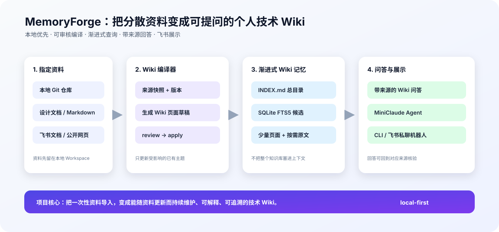
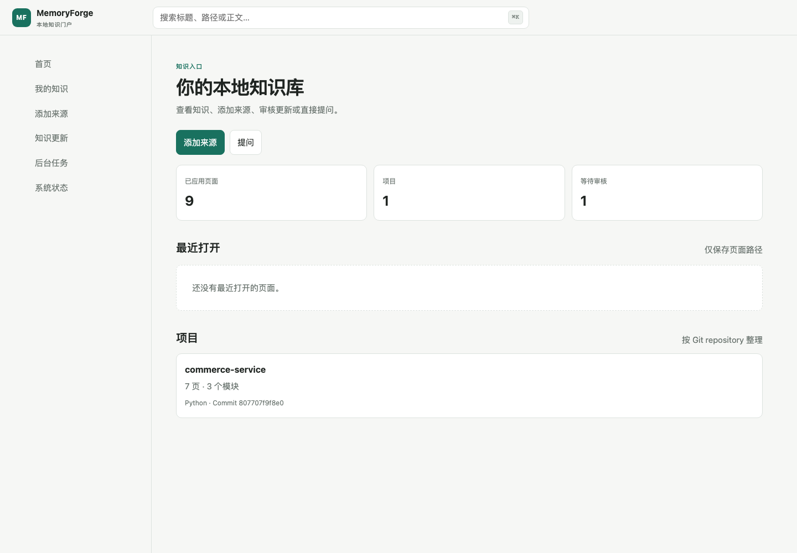
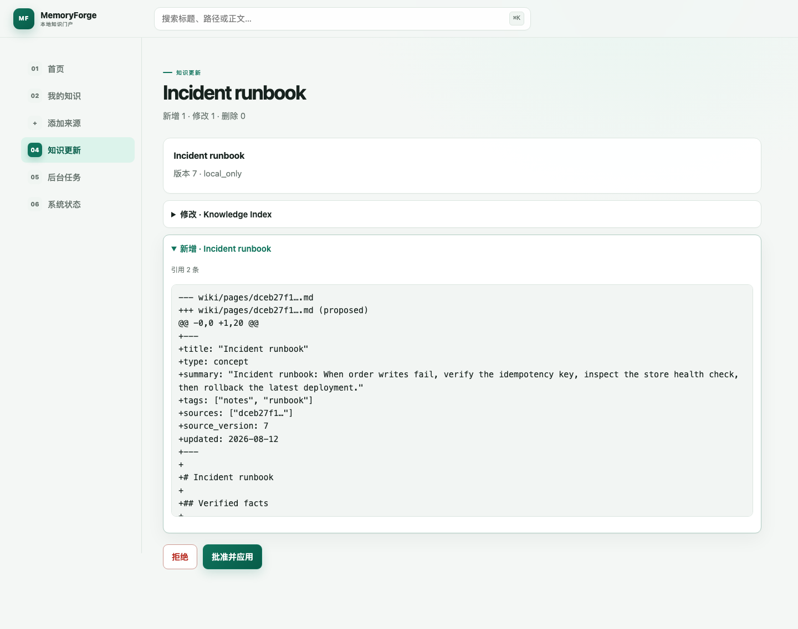
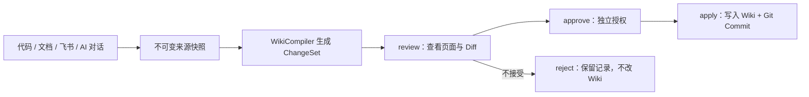
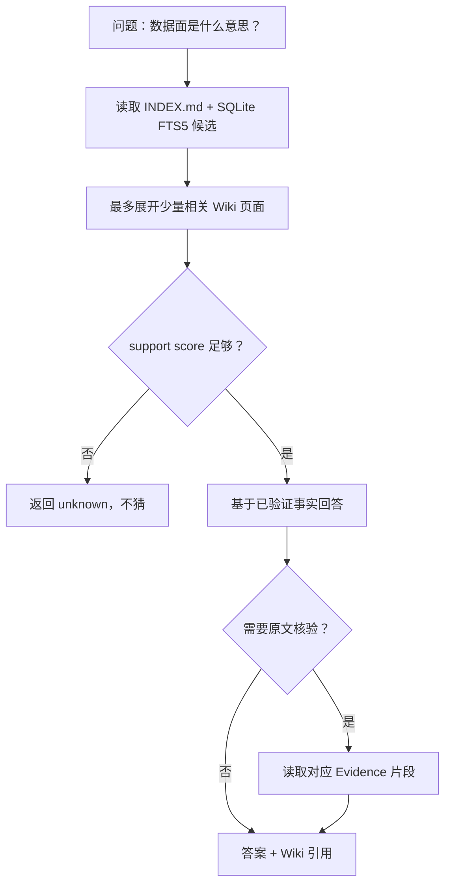
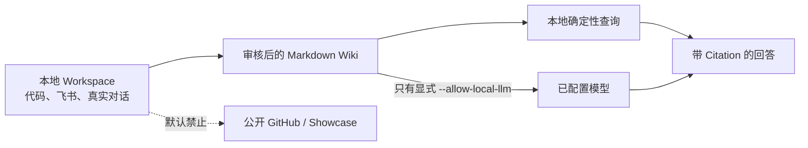
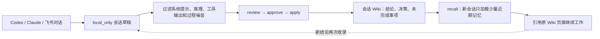

# MemoryForge

<!-- memoryforge-release-claim: version=0.4.0; status=released; supported_platforms=macos; macos_passed=656; linux_status=not_rerun; windows_status=not_verified; release_verification=passed -->

<!-- memoryforge-release-claim: version=0.3.0; status=released; supported_platforms=macos+linux; active_candidate=19; platform_gate_candidate=19; platform_gate_status=accepted; review_status=accepted; macos_passed=642; linux_passed=639; linux_skipped=3; windows_status=not_verified; release_verification=passed -->

> 把代码、文档和 AI 对话编译成可审核、可追溯、可查询的本地技术 Wiki。

> **v0.4.0 发布范围：macOS。** 完整本地门禁 `656 passed`。Linux 未在本版本重跑；
> Windows 尚未验证。最终状态与 SHA256 以 GitHub Release 为准。

[60 秒演示](#60-秒公开演示) · [工作原理](#工作原理) · [5 分钟跑通](#5-分钟跑通) ·
[公开证据](#公开-evidence-与已知失败) · [设计边界](#当前边界)



<p align="center">
  
  
</p>
<p align="center"><sub>v0.4.0 本地只读 Wiki：概览、检索、最近页面、Markdown 阅读器和引用依据。</sub></p>

## 为什么做 MemoryForge？

长期维护项目时，真正难找的往往不是代码，而是“为什么这样设计”“规则写在哪”“哪个方案已经被否决”。这些事实散落在仓库、飞书、ADR、复盘和 AI 对话里，普通搜索只能找到文本，不能说明结论是否仍有效、来自哪个版本、是否经过审核。

**MemoryForge 是一个本地优先的知识编译器。** 它把原始资料编译成可直接阅读的 Markdown Wiki；所有更新先形成 ChangeSet，再经 `review → approve → apply` 发布；查询只读取少量相关页面，证据不足时返回 `unknown`。

它不是“把所有文档塞进提示词”的聊天机器人。运行后得到的是：

- Git 版本化的 Markdown Wiki；
- 可定位到 SourceVersion、原文位置和 Commit 的 Citation；
- 显式、留痕的变更审核链；
- CLI、本地只读 Portal、Obsidian 和飞书入口；
- 可由新 AI 会话按需加载的审核后长期记忆。

适合个人开发者、技术负责人和需要长期维护多个仓库的人。若你要的是公网 SaaS、企业权限平台或不经审核的全自动 RAG，本项目暂不适合。

## 60 秒公开演示

不需要模型 Key、数据库服务或 Web 后台。在仓库根目录运行：

```bash
python3.11 -m venv .venv
.venv/bin/python -m pip install .
.venv/bin/python demo/run_showcase_demo.py \
  --workdir /tmp/memoryforge-showcase-demo \
  --output /tmp/memoryforge-showcase
.venv/bin/python -m webbrowser \
  file:///tmp/memoryforge-showcase/index.html
```

若浏览器拦截 `file://`，启动仅绑定本机的静态服务器，再打开
`http://127.0.0.1:8765/index.html`：

```bash
.venv/bin/python -m http.server 8765 \
  --bind 127.0.0.1 \
  --directory /tmp/memoryforge-showcase
```

Demo 从仓库内固定的 Python、Go、TypeScript 公开夹具开始，真实执行
`import → Code Index → ChangeSet → review → approve → apply → query → showcase`，并展示来源版本、
Wiki 树、Diff、Citation Trace、Benchmark、保留的失败案例、正确拒答和 Mermaid 架构。输出只有
`index.html`、`showcase.json` 和所有权 marker；没有远程脚本或网络请求。

### 它和普通 RAG 的区别

| 普通 RAG | MemoryForge |
| --- | --- |
| 原文切片后直接召回 | 先编译为可读、可审核、可版本化的 Wiki |
| page recall 常被当成回答质量 | 页面路由、事实选择、Answer、Citation 分开评测 |
| 更新直接替换索引 | 先生成 ChangeSet，再 `review → approve → apply` |
| 主题相关就尝试回答 | support score 不足时返回 `unknown` |
| 很难重放一次结论 | Citation 固定到 SourceVersion、locator、Commit 和 SHA256 |

## 公开 Evidence 与已知失败

MemoryForge 把回答、引用和召回分开评测，也保留失败结果。以下数字只适用于各自冻结的数据集，不能外推为任意仓库或生产 SLA。

| Evidence | 结果 | 边界 |
| --- | ---: | --- |
| v0.4.0 本地门禁 | macOS **656 passed** | Linux 未重跑；Windows 未验证 |
| AgentSkill-Eval 文档 Wiki | Answer **96.7%**；Citation **100%**；拒答 **100%** | 单一公开仓库，30 题 |
| 三语言 Code Wiki | Symbol / core Relation / Mermaid / Citation **100%** | 固定公开夹具，不等于全仓 precision / recall |
| Code Module Narrative | 事实覆盖 **90%**；Citation **100%** | 未发布开发集；真实 `seed-2.1-turbo`，20 题 |
| Click 外部迁移 | development / holdout Answer **10% / 0%** | 真实负结果，未隐藏 |

复现方法见 [公开 Benchmark](docs/BENCHMARK.md)，历史主张与限制见
[Evidence Claims](docs/EVIDENCE_CLAIMS.md)，所有接受、拒绝和被替代的实验见
[Benchmark Registry](docs/research/BENCHMARK_REGISTRY.md)。

## 它解决了什么问题？

| 常见问题 | MemoryForge 的做法 |
| --- | --- |
| 资料散在多个仓库、文档和飞书里 | 将指定资料导入一个本地 Workspace，保留来源与版本 |
| 更换 AI 会话后丢失历史上下文 | 将飞书或 Botmux 托管的 AI 对话保存为 `local_only` 草稿，审核后进入长期 Wiki |
| 文档更新后 Wiki 很容易过期 | 根据来源路由更新受影响页面，不重复生成一堆近似摘要 |
| 问答容易胡编或找不到出处 | 先查目录和少量 Wiki 页面；需要时再回读原文并返回引用 |
| 资料敏感，不适合直接上传 | 默认 `local_only`；是否让模型读取本地资料必须显式授权 |
| 不想记忆整套命令行流程 | `memoryforge start` 打开本地 Portal，完成导入、审核、应用、阅读和提问 |

## 核心能力

- **多源资料接入**：递归 Folder（Markdown/TXT/HTML）、已克隆 Git 仓库、单个 GitHub Issue/PR Thread、飞书 Docx/Wiki、单篇公开网页或保存的 HTML。
- **对话记忆草稿**：飞书支持手动或逐轮收录；Botmux 托管的 Codex 等会话可通过 Hook 自动收录。内容默认 `local_only`，仍须人工审核后才进入正式 Wiki。
- **WikiCompiler**：将资料编译为“项目/模块介绍、机制说明、方案与复盘”三类 Markdown 页面；每页都保留来源、版本与原文位置。
- **代码 Wiki**：用 Tree-sitter 为显式选择的 Python、Go、TypeScript/TSX 代码构建确定性符号图、模块计划和带引用 Wiki；可显式授权模型只为父模块补充带 Citation 的职责与调用流程，叶子事实卡和架构图仍由确定性编译器生成。
- **增量更新**：新资料优先扩展已有主题；资料更新时只重编译受影响的页面。
- **渐进式查询**：`INDEX.md → 少量 Wiki 页面 → 按需原文核验`，避免一次把整个知识库塞进上下文。
- **MiniClaude Agent**：只提供 `search_wiki`、`read_evidence`、`final` 三个工具；必须读取证据后才能给出带引用的答案。
- **飞书展示入口**：`feishu-serve` 直接接收飞书私聊消息，查询本地 Wiki 后回复；可显式启用模型，将命中的证据组织成更自然的回答。
- **模型不可用时可降级**：模型服务超时或临时繁忙时，`ask` 和飞书入口回退到已验证的 Wiki 原文，不让用户一直等待或得到无引用的错误答案。
- **可验证性**：提供 `lint` 检查页面/来源关系，提供 `eval` 用公开题集检查回答、引用与读取成本。
- **本地知识门户**：`memoryforge start` 在浏览器中完成来源预览、后台导入、差异审核、明确批准和可选自动更新；所有写操作复用 CLI 的真实生命周期。
- **只读展示**：`memoryforge showcase build` 生成自包含静态 Evidence 页面；默认隐藏
  `local_only` 来源、页面、ChangeSet 和 Citation 细节。

## 工作原理

### 发布链



推荐流程将生成、审阅、授权和落盘分开。`watch`、Botmux Hook 或飞书自动收录都只能生成草稿，
不能直接修改正式 Wiki。

### 查询链



这个路径的重点不是“让模型读得越多越好”，而是让每一步都有明确边界：日常查询不读原文，只有 `--verify` 或 Agent 的 `read_evidence` 才展开对应片段。

## 5 分钟跑通

环境要求：Python 3.11+。v0.4.0 正式验证 macOS；Linux 未在本版本重跑完整门禁。

```bash
git clone https://github.com/still0123/MemoryForge.git
cd MemoryForge

python3.11 -m venv .venv
.venv/bin/python -m pip install .
MF=.venv/bin/memoryforge

# 1. 初始化你的知识库
$MF init ./my-wiki

# 2. 打开本地知识门户
$MF start --workspace ./my-wiki
```

浏览器中按“添加来源 → 后台任务 → 知识更新 → 批准并应用”完成首份资料入库，再从首页提问。
整个流程不需要模型。Portal 只绑定 `127.0.0.1`；来源处理只生成待审核 ChangeSet，只有明确
点击“批准并应用”后才写入正式 Wiki 和新 Git Commit。等价 CLI 命令仍保留在下方“常用命令”。

生成后的 Workspace 大致如下：

```text
my-wiki/
├── raw/                 # 原始资料快照
├── wiki/
│   ├── INDEX.md         # Wiki 总目录
│   └── pages/           # 稳定的 Markdown Wiki 页面
├── .memoryforge/        # SQLite 索引、来源版本和编译路由
└── .git/                # Wiki 自己的修改历史
```

## 用飞书展示项目

飞书是 MemoryForge 的**展示与交互层**，不是另一个通用 Agent 平台的外壳：

```text
飞书私聊消息 -> memoryforge feishu-serve -> 渐进式 Wiki 查询 -> 带来源回复
```

配置好自建飞书应用和 `lark-cli` 后，在运行项目的机器上启动：

```bash
# 纯本地、确定性回答：不调用模型
memoryforge feishu-serve --workspace ./my-wiki

# 显式允许已配置模型读取“本次命中的本地证据”，生成更自然的回答
memoryforge feishu-serve --llm --allow-local-llm --workspace ./my-wiki
```

飞书服务只处理私聊文本并回复原消息。资料仍要先走 `feishu-import → ingest → review → apply`，它不会自动抓取飞书空间或后台同步全部文档。完整配置见 [FEISHU_MVP_SPEC.md](FEISHU_MVP_SPEC.md)。

### 飞书试跑

先确认本地 Workspace 能回答一个已知问题：

```bash
memoryforge feishu-reply '你的测试问题' --workspace ./my-wiki
```

再用 `lark-cli config init --new` 写入自建应用配置，启动 `feishu-serve`，并私聊机器人同一问题。回复应带 `来源 Wiki：wiki/pages/...`；App Secret 只保留在本机，不提交仓库。

## MiniClaude Agent 在哪里？

MemoryForge 不尝试复刻完整 Claude Code。它实现的是一个围绕 Wiki 内核的最小 Agent：

```text
问题 -> search_wiki -> read_evidence -> final（带引用）
```

```bash
memoryforge agent '缓存多久过期？' --workspace ./my-wiki
```

如果连续追问，可以给 Agent 一个本地 session。它只保留最近 3 轮问题、回答和引用片段，
只用来理解“它/这个方案/那数据面”等追问；每一轮仍然必须重新执行
`search_wiki → read_evidence → final`：

```bash
memoryforge agent '管控面主要做什么？' \
  --session interview \
  --workspace ./my-wiki
memoryforge agent '那数据面呢？' \
  --session interview \
  --workspace ./my-wiki

# 清空一个本地会话
memoryforge agent-clear interview --workspace ./my-wiki
```

会话文件只写入 Workspace 的 `.memoryforge/sessions/`，该目录默认被 `.gitignore` 忽略，
不会进入 Wiki 或 Git 提交。没有传 `--session` 时，Agent 仍保持原来的单轮行为。飞书服务则优先
使用事件里的 `chat_id`（缺失时使用 `open_id`）作为 session；事件没有稳定标识时自动退回单轮。

Agent 没有 Shell、通用写文件、Subagent 或 MCP 工具；它只负责在有限步数内检索、核验和回答。session 由系统写入专用本地目录，不是模型可调用的工具。因此项目的重点始终是 Wiki 编译、来源路由与渐进式查询，而不是堆叠通用 Agent 能力。

真实 Agent 评测使用 `memoryforge agent-eval <suite.json> --workspace ./my-wiki --max-steps 4 --max-pages 3`，复用 `EvaluationSuite`，并通过 `run_agent` 读取只读 Workspace；stdout 只输出聚合 JSON，不写 session/ChangeSet/Wiki，也不包含原始 Evidence 或提示词。

## 用公开资料复现

仓库提供了仅基于公开 `AgentSkill-Eval` 文档的 Demo，不需要模型 Key，也不上传资料：

```bash
.venv/bin/python demo/run_public_demo.py \
  --source-repo ~/code/AgentSkill-Eval \
  --workspace /private/tmp/memoryforge-public-demo \
  --output /private/tmp/agent_skill_eval_public.json
```

脚本会真实执行：

```text
init -> git-add --public -> git-sync -> ingest -> review -> approve -> apply -> lint -> ask -> eval
```

已提交的公开结果在 [demo/results/agent_skill_eval_public.json](demo/results/agent_skill_eval_public.json)。`eval` 会检查回答是否命中关键事实、引用是否可回溯，以及每题实际展开了多少 Wiki 页面/原文字符。

私有 Workspace 手工 50 题评测流程见 [用户评测指南](docs/USER_EVALUATION.md)。

脚本也支持重复传入 `--source-repo`，将多个已克隆的公开仓库编译进同一个 Workspace；你的公开个人题集示例和命令见 [多仓库 Demo](demo/README.md#多仓库个人资料演示)。

### 公开对照结果

同一份 30 题公开题集上，MemoryForge 与“直接在原始资料上做 OR + BM25 Top-3”的 Raw FTS 基线结果如下：

| 指标 | MemoryForge | Raw FTS |
| --- | ---: | ---: |
| Top-3 来源召回率 | **96.2%** | 57.7% |
| 多来源完整覆盖率 | **100.0%** | 20.0% |
| 回答准确率 | 96.7% | 不适用 |
| 引用落地准确率 | 100.0% | 不适用 |
| 无答案拒答准确率 | 100.0% | 不适用 |
| 平均证据/候选文本字符数 | 159.2 | 728.0 |

Raw FTS 只负责检索，不生成答案，所以不能拿它计算回答、引用或拒答准确率。完整方法、失败案例和复现说明见 [公开 Benchmark](docs/BENCHMARK.md)。

### 发布复现

发布门禁在本机执行 Ruff、Mypy、pytest、Wheel/sdist 双 clean-room 安装、Workspace
backup/restore 和 SHA256 回放，不使用 hosted runner。完整命令、产物命名和手动发布流程见
[本地免费工具链](docs/LOCAL_FREE_TOOLING.md)；Wheel 独立复现参数见
[`demo/run_release_check.py`](demo/run_release_check.py)。v0.4.0 的最终 Commit、依赖版本和
制品 SHA256 以 GitHub Release 附带的 `release-provenance.json` 与 `SHA256SUMS` 为准。

如果要按秋招面试的方式完整演示，直接看 [秋招演示与面试说明](docs/PORTFOLIO_DEMO.md)。里面包含 3 分钟讲解顺序、公开 Demo 命令、飞书展示命令和常见追问。

发布范围与验证结果见 [CHANGELOG.md](CHANGELOG.md)；可直接用于简历的中文项目描述见 [简历表述](docs/RESUME.md)。

## 关键设计取舍

| 选择 | 原因 |
| --- | --- |
| Markdown Wiki 而非只存向量 | 即使不问模型，人也能阅读、审核和维护沉淀内容 |
| `review → approve → apply` 而非直接生成 | 审阅、授权和落盘分别留痕；避免自动覆盖已有知识 |
| `INDEX + FTS5 + 页面展开` 而非全量拼接 | 控制检索范围和上下文成本，便于解释“这次读了什么” |
| 证据优先的最小 Agent | 让模型负责组织答案，不让它执行代码或扩展为难控的通用助手 |
| 静态 Showcase 为默认展示 | 零 Key、零服务器、可直接审查；飞书只保留为可选聊天入口 |

## 资料与模型边界



- 公开 GitHub 仓库只提交代码、虚构或公开 Demo、脱敏评测结果。
- 公司代码、真实飞书正文、真实 Wiki、Token、App Secret 与运行日志都留在本机，不能提交或上传到 GitHub。
- Git/飞书资料默认标为 `local_only`，不会被模型读取。
- 只有你明确传入 `--allow-local-llm`，当前命中的本地证据才会发送给已配置模型；这不会自动将资料变成公开内容。

## 常用命令

```bash
# 资料导入
memoryforge import <path> --workspace <workspace>
memoryforge git-add <local-checkout> --workspace <workspace>
memoryforge code-add <repository-id> <relative-path> --workspace <workspace>
memoryforge git-sync <repository-id> --workspace <workspace>
memoryforge feishu-import <docx-or-wiki-url-or-token> --workspace <workspace>
memoryforge web-import <public-http-url> --workspace <workspace>

# Wiki 编译与检查
memoryforge ingest --pending --workspace <workspace>
memoryforge ingest --code-wiki <repository-id> --workspace <workspace>
memoryforge ingest --code-wiki <repository-id> --llm --allow-local-llm --workspace <workspace>
memoryforge watch --interval 60 --workspace <workspace>
memoryforge changeset-list --workspace <workspace>
memoryforge review <changeset-id> --workspace <workspace>
memoryforge approve <changeset-id> --workspace <workspace>
memoryforge apply <changeset-id> --workspace <workspace>
memoryforge status --workspace <workspace>
memoryforge source-list --workspace <workspace>
memoryforge doctor --workspace <workspace>
memoryforge history --workspace <workspace>
memoryforge rollback <historical-commit> --workspace <workspace>
memoryforge lint --workspace <workspace>

# 问答与展示
memoryforge start --workspace <workspace>
memoryforge ask '<question>' --workspace <workspace>
memoryforge recall --workspace <workspace>
memoryforge agent '<question>' --workspace <workspace>
memoryforge obsidian-build --workspace <workspace>
memoryforge showcase build --workspace <workspace> --output <directory>
memoryforge showcase serve --workspace <workspace> --port 8765
memoryforge feishu-serve --workspace <workspace>
```

## 本地 Wiki 动态服务

日常使用只需一个入口：

```bash
memoryforge start --workspace <workspace>
```

Portal 只绑定 `127.0.0.1`，支持按需阅读、搜索、添加本地仓库/Codex 会话/文件/飞书/网页，
后台任务完成后停在“等待审核”。只有用户点击“批准并应用”才记录 review、approval receipt
并写入新的 Wiki Commit。写操作校验同源 `Origin`、页面内存 CSRF token 和 Workspace 锁。
脚本仍可使用 `memoryforge showcase serve --workspace <workspace> --port 8765`，它不会自动打开浏览器。

## Obsidian 本地视图

`memoryforge obsidian-build --workspace <workspace>` 只在 `obsidian/` 生成
Obsidian 导航 Markdown，不复制 Wiki 正文，也不依赖插件。把整个 `<workspace>` 作为 Vault
打开，再进入 `obsidian/Home.md`。`local_only` 页面不会进入共享业务状态；重复构建不修改
`raw/`、`wiki/` 或 SQLite 投影。

## AI 会话如何变成长效记忆

MemoryForge 不把整个聊天记录塞进每次提示词。它保留完整本地 Evidence，只把审核后的近期结论、决策和未完成事项渐进式提供给新会话。



三种收录方式都只生成 `local_only` 草稿，不会自动批准：

```text
飞书：/wiki 收录 或 /wiki auto on
Botmux：生命周期 Hook 调用 memoryforge botmux-hook
Codex：memoryforge codex-import <rollout.jsonl>
```

Codex 本地对话可直接从 rollout JSONL 收录，只保留 user / assistant 文本；系统提示、
推理和工具输出会被排除：

```bash
memoryforge codex-import ~/.codex/sessions/YYYY/MM/DD/rollout-*.jsonl \
  --title '本次讨论主题' --workspace <workspace>
```

AI 回复始终按未验证材料处理；只有走完 `ingest → review → approve → apply` 才进入正式
Wiki。`memoryforge recall` 只返回已应用的近期结论、决策、未完成事项和引用，不调用模型。
`memoryforge codex-setup` 可把这条有界 recall 规则写入项目 `AGENTS.md`。Botmux 事件配置格式见
[官方 Hook 文档](https://deepcoldy.github.io/botmux/hooks.html)。

## 文档导航

- [SPEC：架构、数据模型与安全边界](SPEC.md)
- [公开 Benchmark：方法、结果与失败案例](docs/BENCHMARK.md)
- [Code Module Narrative：后序编译与 Citation 契约](docs/research/CODE_MODULE_NARRATIVE.md)
- [本地 Wiki Portal：只读与隐私约束](docs/LOCAL_WIKI_PORTAL_SPEC.md)
- [用户评测指南：为私有 Workspace 建立 50 题题集](docs/USER_EVALUATION.md)
- [秋招演示：3 分钟讲解与常见追问](docs/PORTFOLIO_DEMO.md)
- [CHANGELOG：版本范围与验证结果](CHANGELOG.md)

更多命令运行 `memoryforge --help`。

## 当前边界

当前版本功能冻结，后续只修 Bug、错误回答和文档。项目刻意不做公网部署、群聊、多用户权限、
向量数据库、知识图谱、通用编码 Agent 或多 Agent 编排；主线只服务“个人技术 Wiki 如何持续
更新、可靠查询并回到证据”。
