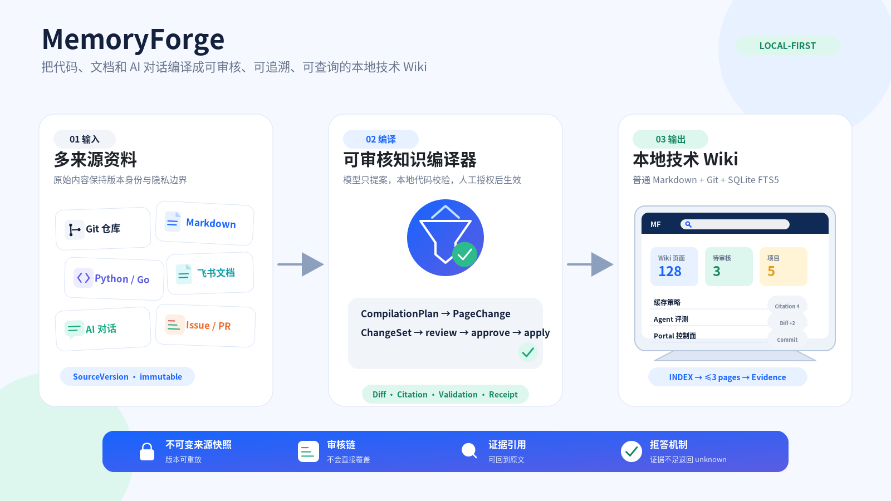
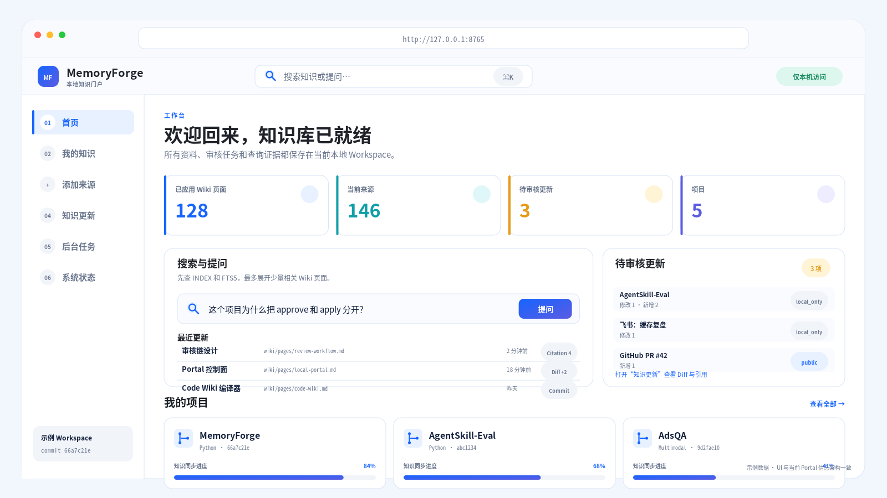
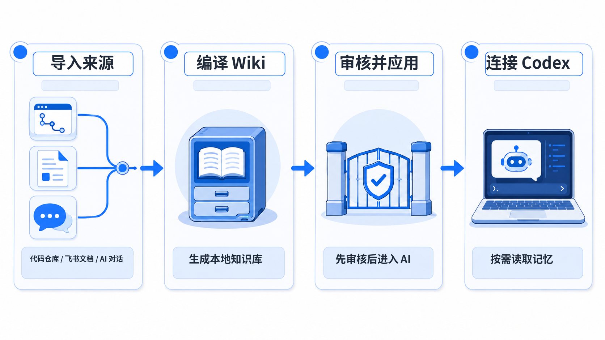
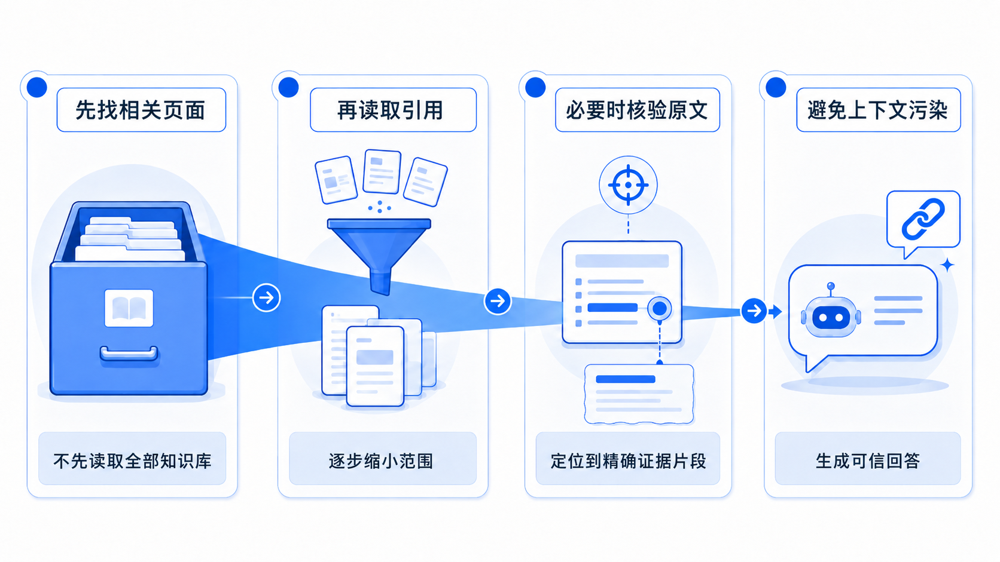
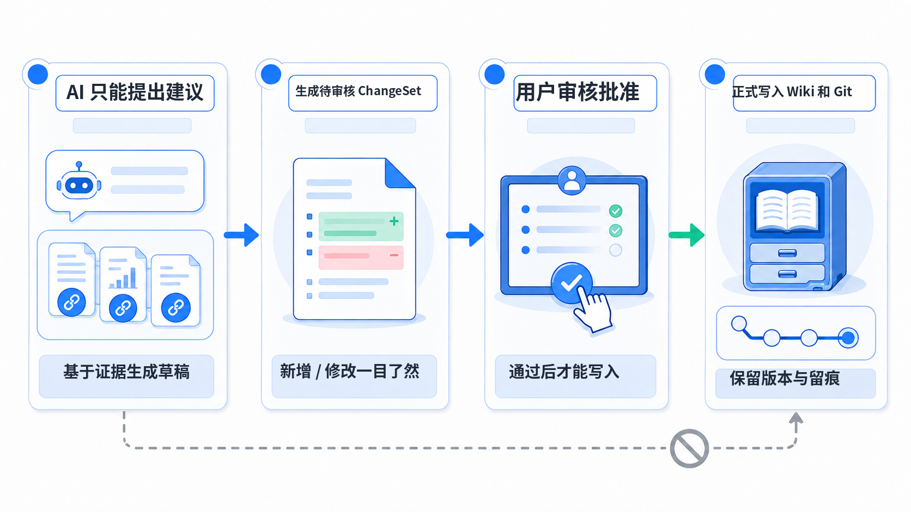
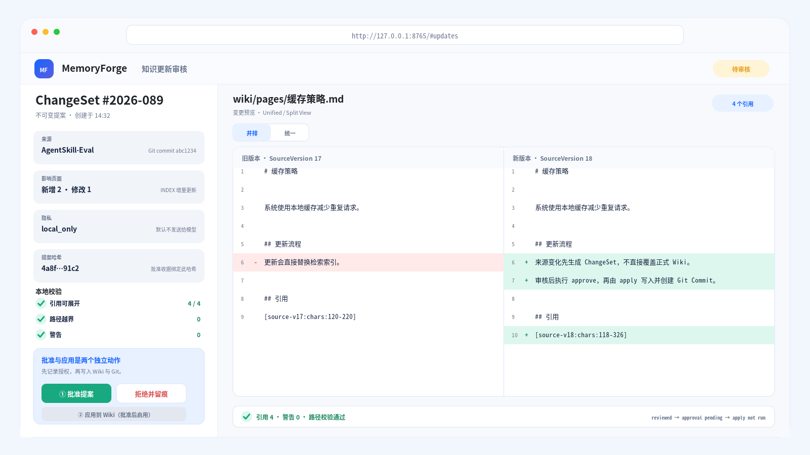
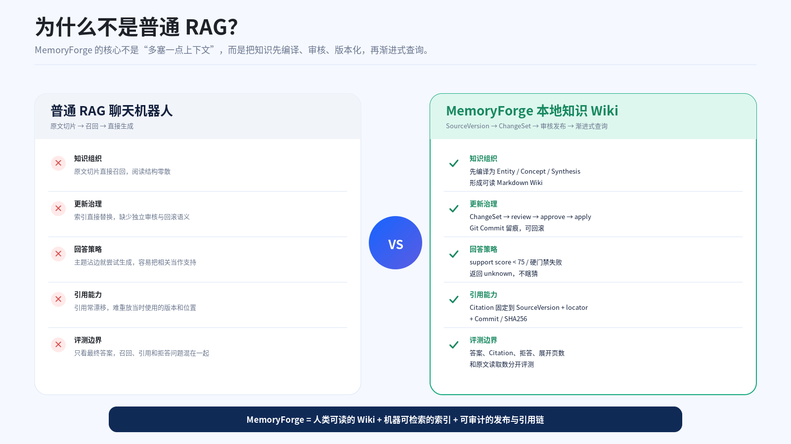
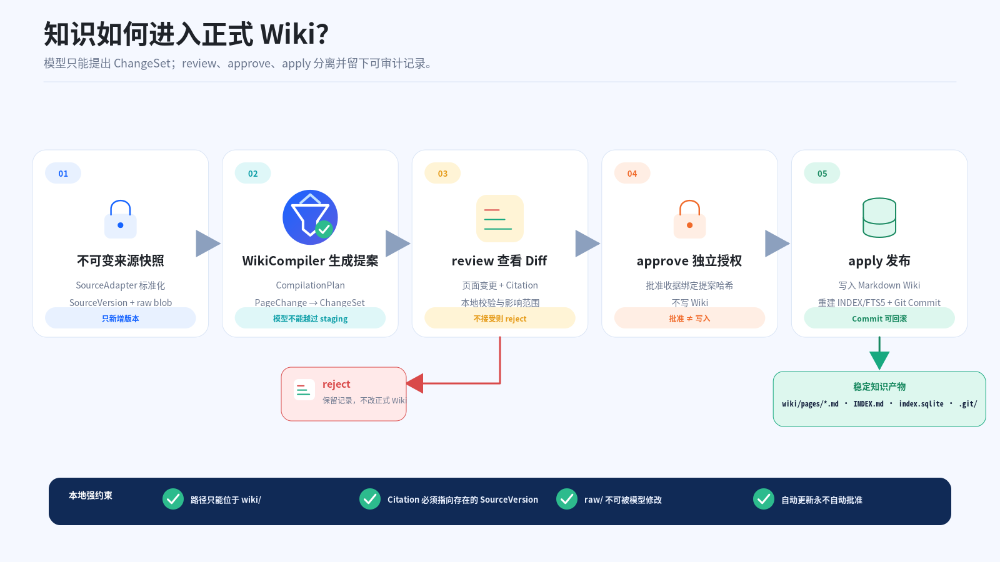
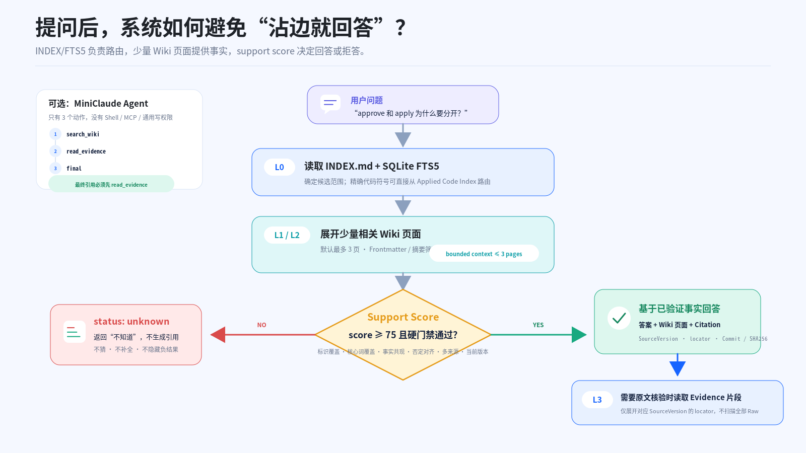
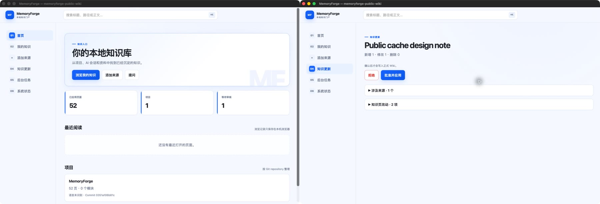

# MemoryForge

<!-- memoryforge-release-claim: version=0.4.0; status=released; supported_platforms=macos; macos_passed=656; linux_status=not_rerun; windows_status=not_verified; release_verification=passed -->

> 把代码、文档和 AI 对话编译成可审核、可追溯、可查询的本地技术 Wiki。

MemoryForge 是一个本地优先的知识编译器。它不把所有资料直接塞给模型，而是先生成可读、
可版本化的 Markdown Wiki；每次更新都经过 `review → approve → apply`，查询结果可以回到固定
SourceVersion 和原文位置。

**正式版本：[`v0.4.0`](https://github.com/still0123/MemoryForge/releases/tag/v0.4.0)**：
macOS 完成 `656 passed` 发布门禁，Windows 尚未验证。当前 `main` 另含未发布的后续功能，
验证数字见下方[公开证据](#公开证据)。

[5 分钟跑通](#5-分钟跑通) · [60 秒演示](#60-秒公开演示) ·
[在 Codex 中使用](#在-codex-中使用推荐) · [macOS 桌面端](#macos-桌面端推荐日常使用) ·
[公开证据](#公开证据) · [演示讲稿](docs/PORTFOLIO_DEMO.md) ·
[设计文档](SPEC.md)



## 一眼看懂

| 入口 | 看什么 |
| --- | --- |
| **核心产品** | Source → ChangeSet → 人工审核 → Markdown Wiki → Query / Agent / Portal |
| **公开证据** | 零 Key 端到端 Demo、固定题集、Citation、拒答、负结果和 Release SHA256 |
| **历史研究** | 被拒绝或被替代的 Candidate、实验边界和完整 Benchmark Registry |

项目适合个人开发者、技术负责人和长期维护多个仓库的人。它不是公网 SaaS、企业权限平台，
也不是拥有 Shell 和任意写权限的通用编码 Agent。



<sub>上图为依据当前 Portal 信息架构制作的**示例数据高保真模拟图**，不是伪装成真实运行数据的截图。</sub>

## 从建库到在 AI 中提问

MemoryForge 的日常使用是两段式的：先把资料变成**已审核的 Wiki**；再在你平常使用的
Codex 对话中按需查它。不是把整个 Wiki 或全部历史对话塞进每一个新会话。



### 1. 建立可信知识

在一个单独的 Workspace 中导入代码、文档或对话；每次资料更新都走
`ingest → review → approve → apply`。只有应用后的页面会成为 AI 可查询的长期知识。

```bash
memoryforge init /absolute/path/to/my-wiki
memoryforge import /absolute/path/to/design.md --workspace /absolute/path/to/my-wiki
memoryforge ingest --pending --workspace /absolute/path/to/my-wiki
# 在 Portal 或 CLI 中 review → approve → apply
```

代码仓库需要先通过 `git-add → git-sync → ingest --code-wiki` 进入同一个 Workspace；完整步骤见
[中文使用指南](docs/USER_GUIDE_CN.md#6-导入代码仓库并生成-code-wiki)。

### 2. 只连接 Codex 一次

对**一个 Workspace**执行一次全局连接：

```bash
memoryforge connect codex --workspace /absolute/path/to/my-wiki
```

重启 Codex（或 ChatGPT Desktop / IDE 扩展）后，用 `/mcp` 确认 `memoryforge` 已出现。此推荐模式
只注册一个本地只读 MCP Server，并安装一个小型 `memoryforge-knowledge` Codex Skill；**不会为每个
仓库重复注册，不会改写项目的 `AGENTS.md`，也不会在新对话里自动注入旧会话**。Skill 只描述何时
按需调用 MCP。

之后直接在任何新对话中正常提问即可。Codex 会在问题涉及项目历史、既有决策或 Wiki 时，调用
`memoryforge_context`；不必每次先说“请查 MemoryForge”。若某次回答必须以知识库为准，可以明确说
“先查 MemoryForge，再回答”。

MemoryForge 搜索整个已应用 Workspace：当前打开的已登记项目只会使本项目页面排在前面，**不是**
访问边界。因此空白新对话、未登记项目，以及跨多个仓库的提问都能工作。

### 3. 在当前对话中加载指定旧会话

先创建任意 Codex 或 Claude 对话，然后直接说：

```text
列出我最近的 MemoryForge 主题
加载第 2 个主题
```

MemoryForge 用 `memoryforge_episodes` 把近期会话按主题聚合，只返回主题、短摘要和原始会话引用；你
选择后，再由 `memoryforge_load_session` 把有字符上限的 Episode Capsule 加入**当前对话**。需要精确
时间线时仍可说“列出最近会话”。不要求当前目录已登记，也不需要终端命令或重启客户端。内容会标记为
未验证历史，重要结论仍需通过当前代码、测试或正式 Wiki 证据确认。

之后继续问这段历史时，Host 会保留所选会话引用，并把新问题交给同一个工具：只在这些会话中返回
相关结论，而不是再次注入整段 Capsule。若返回 `no_session_evidence`，才回退到项目/跨仓库 Wiki
检索。这样既保留“我指定这几段历史”的边界，也避免长对话持续占用 Token。

若确实需要“下一次新任务自动加载”，可显式执行 `memoryforge connect codex --startup-hook`，再使用
`memoryforge continue`。它不是默认行为。完整说明见
[多客户端接入指南](docs/MULTI_CLIENT_SETUP.md#4-session-capsule把旧会话带进下一次新对话)。

### 4. 按需展开，控制 Token



一次查询先返回少量相关页面和 Citation；只有需要时才读取某条原文 Evidence。MCP 调用成功统一返回
`status: ok`，项目证据另分 `grounded`、`partial`、`no_local_evidence`。`partial` 会保留已支持的结论
和引用；`no_local_evidence` 只表示 Wiki 没有项目证据，AI 仍可提供明确标注的通用分析。

### 5. AI 的新结论仍需审核



AI 可以基于 Citation 提出 ChangeSet，但不能直接改变正式 Wiki 或 Git。你在 Portal 或 CLI 中查看 Diff、
批准并应用后，它才会成为后续对话可复用的知识。

> 默认只向 AI Host 提供 `public` 来源。`local_only` 内容必须在连接时显式使用
> `--allow-local-llm` 授权，且该授权会作用于这个 Workspace 的全部命中内容。

项目专属连接仍可使用 `memoryforge connect codex /absolute/path/to/project`；它适用于只希望在该项目
中安装 on-demand 指令的场景。大多数个人多仓库工作流应使用上面的全局连接。详见
[全局 Codex MCP Router](docs/GLOBAL_CODEX_MCP_ROUTER.md)。

## 核心产品

MemoryForge 解决四个问题：

- **资料分散**：接入本地 Git、文件夹、Markdown/TXT/HTML、飞书文档、公开网页和 GitHub
  Issue/PR。
- **知识会过期**：来源变化只生成待审核 ChangeSet，不直接覆盖正式 Wiki。
- **回答不可核验**：Citation 固定到 SourceVersion、原文 locator、Commit 和 SHA256。
- **AI 会话会丢失**：对话先保存为 `local_only` 草稿，审核后才进入长期记忆。

运行后得到的是普通文件和本地索引：

```text
my-wiki/
├── raw/                 # 不可变来源快照
├── wiki/
│   ├── INDEX.md         # Wiki 总目录
│   └── pages/           # 可读 Markdown 页面
├── .memoryforge/        # SQLite 索引、任务和编译路由
└── .git/                # Wiki 变更历史
```



<sub>上图刻意将 `approve` 与 `apply` 画成两个动作：先记录独立授权，再写入 Wiki 与 Git。为示例数据高保真模拟图，非真实运行截图。</sub>

### 和普通 RAG 的区别

| 普通 RAG | MemoryForge |
| --- | --- |
| 原文切片后直接召回 | 先编译为可读、可审核、可版本化的 Wiki |
| 更新直接替换索引 | 先生成 ChangeSet，再 `review → approve → apply` |
| 主题相关就尝试回答 | support score 不足时返回 `unknown` |
| 很难重放一次结论 | Citation 固定到来源版本、locator、Commit 和 SHA256 |



## 工作原理

### 知识如何进入正式 Wiki？

模型只能提出 ChangeSet；review、approve、apply 三分离，并留下可审计记录：

1. **不可变来源快照**：SourceAdapter 标准化为 SourceVersion + raw blob，只新增版本，不覆盖旧版
2. **WikiCompiler 生成提案**：CompilationPlan → PageChange → ChangeSet，模型不能越过 staging
3. **review 查看 Diff**：页面变更 + Citation，本地校验与影响范围，不接受则 reject 保留记录
4. **approve 独立授权**：批准收据绑定提案哈希，**不等于写入**
5. **apply 发布**：写入 Markdown Wiki、重建 INDEX/FTS5、产生 Git Commit，可回滚



> 本地硬约束：路径只能位于 `wiki/`；Citation 必须指向存在的 SourceVersion；`raw/` 不可被模型修改；自动更新永不自动批准。

### 提问后，系统如何避免"沾边就回答"？

INDEX/FTS5 负责路由，少量 Wiki 页面提供事实，support score 决定回答或拒答。

```text
用户问题 → L0 读 INDEX.md + SQLite FTS5（确定候选范围）
        → L1/L2 展开 ≤3 个相关 Wiki 页面（Frontmatter/摘要版）
        → Support Score ≥ 75 且硬门禁通过？
            ├─ NO  → status: unknown，返回"不知道"，不猜不补全
            └─ YES → 基于已验证事实回答（答案 + Wiki 页面 + Citation）
                      必要时进入 L3 读取 Evidence 片段（只展开对应 locator，不扫 Raw）
```

MiniClaude Agent 只有 `search_wiki`、`read_evidence`、`final` 三个工具；没有 Shell、通用写文件、Subagent 或 MCP 权限；`final` 必须先执行 `read_evidence`。

代码 Wiki 使用 Tree-sitter 为显式选择的 Python、Go、TypeScript/TSX 文件构建确定性 Symbol、Relation、ModulePlan 和 Mermaid 图。可选模型只补充带 Citation 的父模块叙事，不生成架构边。



## 5 分钟跑通

环境要求：Python 3.11+。当前正式支持范围以 v0.4.0 的 macOS 发布证据为准。

PyPI 发布完成后可只安装 CLI：

```bash
python3.11 -m pip install memoryforge-wiki
```

从源码运行 Portal 和公开 Demo：

```bash
git clone https://github.com/still0123/MemoryForge.git
cd MemoryForge

python3.11 -m venv .venv
.venv/bin/python -m pip install .
MF=.venv/bin/memoryforge

$MF init ./my-wiki
$MF start --workspace ./my-wiki
```

浏览器中按"添加来源 → 后台任务 → 知识更新 → 批准并应用"完成首份资料入库，再从首页搜索或提问。Portal 只绑定 `127.0.0.1`；自动更新只生成待审核内容，永不自动批准。

CLI 等价流程：

```bash
$MF import ./docs --workspace ./my-wiki
$MF ingest --pending --workspace ./my-wiki
$MF review  <changeset-id> --workspace ./my-wiki
$MF approve <changeset-id> --workspace ./my-wiki
$MF apply   <changeset-id> --workspace ./my-wiki
$MF ask '这个项目为什么这样设计？' --workspace ./my-wiki
```

## macOS 桌面端（推荐日常使用）

桌面端把本地 Portal 放进原生 macOS 窗口：日常只需双击应用，不打开浏览器，也不会访问远程网页。
首次使用需选择已初始化的 Workspace；之后会自动重开上次的知识库。



<sub>真实运行截图：左为使用公开 MemoryForge 源码构建的 52 页本地知识库；右为一条公开资料的待审核更新。截图不含用户本地数据。</sub>

从源码安装并构建：

```bash
git clone https://github.com/still0123/MemoryForge.git
cd MemoryForge

python3.11 -m venv .venv
.venv/bin/python -m pip install -e '.[desktop]'
.venv/bin/memoryforge init ./my-wiki  # 已有 Workspace 时跳过
./scripts/build_macos_app.sh
open dist/MemoryForge.app
```

随后可直接双击 `dist/MemoryForge.app`。第一次请选择 `my-wiki` 这样的已初始化 Workspace，
而不是 MemoryForge 的源码目录；日常使用路径为“添加来源 → 后台任务 → 知识更新 → 批准并应用”。

开发时也可以不打包，直接运行：

```bash
.venv/bin/memoryforge desktop --workspace ./my-wiki
```

完整说明见 [macOS 桌面端指南](docs/DESKTOP_APP_CN.md)。

## 60 秒公开演示

不需要模型 Key、数据库服务或外部仓库：

```bash
.venv/bin/python demo/run_showcase_demo.py \
  --workdir /tmp/memoryforge-showcase-demo \
  --output /tmp/memoryforge-showcase
.venv/bin/python -m webbrowser \
  file:///tmp/memoryforge-showcase/index.html
```

Demo 使用仓库内固定的 Python、Go、TypeScript 夹具，真实执行：

```text
import → Code Index → ChangeSet → review → approve → apply → query → showcase
```

页面展示来源版本、Wiki 树、Diff、Citation Trace、正确拒答、已知失败和 Mermaid 架构图；生成文件不包含远程脚本、模型调用、绝对 Workspace 路径或凭据。

完整的 3 分钟讲解顺序和常见追问见
[演示讲稿](docs/PORTFOLIO_DEMO.md)。

## 公开证据

以下数字只适用于各自冻结的数据集，不能外推为任意仓库或生产 SLA。

| Evidence | 结果 | 边界 |
| --- | ---: | --- |
| 当前 `main` 本地门禁 | macOS **731 passed** | CPython 3.11；Linux/Windows 未重跑 |
| v0.4.0 发布门禁 | macOS **656 passed** | Linux 未重跑，Windows 未验证 |
| AgentSkill-Eval 文档 Wiki | Answer **96.7%**；Citation **100%**；拒答 **100%** | 单一公开仓库，30 题 |
| 三语言 Code Wiki | Symbol / Relation / Mermaid / Citation **100%** | 固定公开夹具 |
| Code Module Narrative | 事实覆盖 **90%**；Citation **100%** | 未发布开发集，20 题 |
| Click 外部迁移 | development / holdout Answer **10% / 0%** | 真实负结果，未隐藏 |

公开复现方法见 [Benchmark](docs/BENCHMARK.md)，可审计主张见
[Evidence Claims](docs/EVIDENCE_CLAIMS.md)，正式制品、provenance 和 `SHA256SUMS` 见
[v0.4.0 Release](https://github.com/still0123/MemoryForge/releases/tag/v0.4.0)。

`demo/` 只负责可运行脚本、固定夹具和机器可读 Evidence。大量 rejected/superseded Candidate
属于研究历史，阅读入口统一放在
[Research Archive](docs/research/README.md)。

## 隐私边界

- 公开仓库只提交代码、公开或虚构 Demo、脱敏评测结果。
- 公司代码、真实飞书正文、Token、App Secret 和运行日志只留在本机。
- Git、飞书、代码和会话来源默认 `local_only`，不会发送给模型。
- 只有显式传入 `--allow-local-llm`，当前命中的本地证据才会交给已配置模型。
- Showcase 默认隐藏 `local_only` 来源、页面、ChangeSet 和 Citation 细节。

## 文档导航

| 文档 | 内容 |
| --- | --- |
| [中文使用指南](docs/USER_GUIDE_CN.md) | 安装、导入、问答与 AI Host MCP 接入 |
| [macOS 桌面端指南](docs/DESKTOP_APP_CN.md) | 原生窗口、Workspace 选择与打包方式 |
| [SPEC.md](SPEC.md) | 架构、数据模型和安全边界 |
| [本地 Portal](docs/LOCAL_DYNAMIC_PORTAL_SPEC.md) | 阅读、任务、审核和控制面 |
| [公开 Benchmark](docs/BENCHMARK.md) | 方法、结果、负案例和复现命令 |
| [Evidence Claims](docs/EVIDENCE_CLAIMS.md) | 主张、证据和不能外推的边界 |
| [研究归档](docs/research/README.md) | Candidate、负结果和历史 Evidence |
| [CHANGELOG](CHANGELOG.md) | 版本范围和验证状态 |

飞书接入见 [FEISHU_MVP_SPEC.md](FEISHU_MVP_SPEC.md)，完整 CLI 运行
`memoryforge --help`，本地发布门禁见
[LOCAL_FREE_TOOLING.md](docs/LOCAL_FREE_TOOLING.md)。

## 当前边界

功能范围已冻结，后续只修 Bug、错误回答和文档。项目刻意不做公网部署、群聊、多用户权限、
向量数据库、知识图谱、通用编码 Agent 或多 Agent 编排。

<!-- memoryforge-release-claim: version=0.3.0; status=released; supported_platforms=macos+linux; active_candidate=19; platform_gate_candidate=19; platform_gate_status=accepted; review_status=accepted; macos_passed=642; linux_passed=639; linux_skipped=3; windows_status=not_verified; release_verification=passed -->
