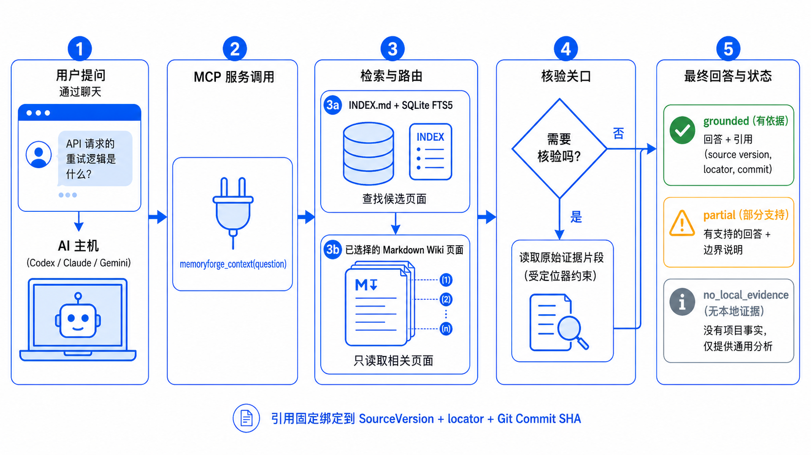
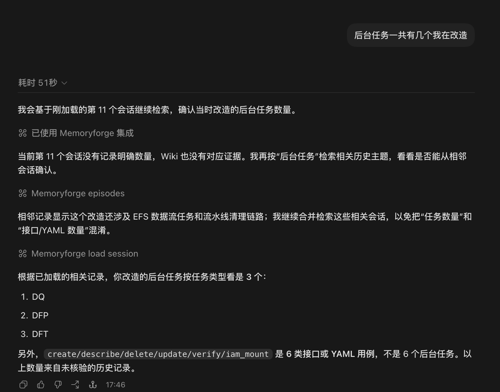

# MemoryForge

<!-- memoryforge-release-claim: version=0.4.0; status=released; supported_platforms=macos; macos_passed=656; linux_status=not_rerun; windows_status=not_verified; release_verification=passed -->

> 把代码、文档和 AI 对话编译成可审核、可追溯、可查询的本地技术 Wiki。

MemoryForge 是一个本地优先的知识编译器。它把分散资料整理成可读、可版本化的 Markdown
Wiki，再按需提供给人或 AI。每次更新都经过审核，有证据的答案可回到固定来源版本和原文位置。

**正式版本：[`v0.4.0`](https://github.com/still0123/MemoryForge/releases/tag/v0.4.0)**

[快速开始](#快速开始) · [在 AI 应用中使用](#在-ai-应用中使用) ·
[Windows 桌面端](#windows-桌面端) · [中文指南](docs/USER_GUIDE_CN.md) ·
[60 秒演示](docs/PORTFOLIO_DEMO.md) ·
[设计文档](SPEC.md)


## 它解决什么

MemoryForge 支持本地 Git 仓库、文件夹、Markdown/TXT/HTML、飞书文档、公开网页、
GitHub Issue/PR 和 AI 对话。最终产物仍是普通 Markdown、Git 历史与本地 SQLite 索引。

- **更新可审核**：生成、审阅、授权和写入分离，AI 不能直接修改正式 Wiki。
- **结论可追溯**：Citation 固定到 SourceVersion、原文 locator、Commit 和 SHA256。
- **上下文按需加载**：先定位少量 Wiki 页面，必要时才读取对应 Evidence。
- **证据不足不猜测**：部分证据只支持部分结论；没有本地证据时不编造项目事实。
- **旧会话可选择性加载**：按主题聚合历史对话，按需把指定会话上下文带入当前任务。
- **多客户端统一接入**：同一本地 Wiki 可同时供 Codex、Claude Code、Gemini 等应用查询。
- **资料默认留在本机**：Git、飞书、代码和会话来源默认标记为 `local_only`。

### 和普通 RAG 的区别

| 普通 RAG | MemoryForge |
| --- | --- |
| 原文切片后直接召回 | 先编译为可读、可审核、可版本化的 Wiki |
| 更新直接替换索引 | 先生成 ChangeSet，再 `review → approve → apply` |
| 主题相关就尝试回答 | 证据状态不足时保留边界，不补全项目事实 |
| 很难重放一次结论 | Citation 固定到来源版本、locator、Commit 和 SHA256 |

## 快速开始

需要 Python 3.11+。v0.4.0 的正式验证范围为 macOS。

**从源码安装（推荐，保证最新版本）：**

```bash
git clone https://github.com/still0123/MemoryForge.git
cd MemoryForge

python3.11 -m venv .venv
source .venv/bin/activate
python -m pip install .

memoryforge init ./my-wiki
memoryforge start --workspace ./my-wiki
```

> 如果 PyPI 安装 `python -m pip install memoryforge-wiki` 失败（镜像源同步问题或包未发布），请使用上面的源码安装方式。

Portal 只绑定 `127.0.0.1`。在浏览器中按"添加来源 → 后台任务 → 知识更新 → 批准并应用"
完成首份资料入库，再从首页搜索或提问。

最小 CLI 流程：

```bash
memoryforge import /absolute/path/to/design.md --workspace ./my-wiki
memoryforge ingest --pending --workspace ./my-wiki
memoryforge review <changeset-id> --workspace ./my-wiki
memoryforge approve <changeset-id> --workspace ./my-wiki
memoryforge apply <changeset-id> --workspace ./my-wiki
memoryforge ask '这个项目为什么这样设计？' --workspace ./my-wiki
```

重新编译所有当前 AI 会话（包括已应用版本）仍只会生成待审核 ChangeSet：

```bash
memoryforge recompile conversations --workspace ./my-wiki
memoryforge recompile conversations --workspace ./my-wiki --trae --allow-local-llm
```

`--trae` 固定使用 `gpt-5.6-sol__max` 与 `xhigh` 推理强度；它会把本地会话发送给
该模型，因此必须显式授权。两种模式都只生成 `PROPOSED` ChangeSet，不会自动发布。

源码安装、代码仓库、飞书、网页、GitHub Thread、AI 会话和桌面端的完整步骤见
[中文使用指南](docs/USER_GUIDE_CN.md)。

## 工作原理

### 发布知识

SourceAdapter 保存不可变来源版本，WikiCompiler 只生成待审核 ChangeSet。`review` 查看 Diff、
引用和影响范围；`approve` 记录独立授权；`apply` 才写入 Wiki、更新索引并创建可回滚的 Git
Commit。自动更新也不能跳过这条链路。


### 查询知识

查询先通过 `INDEX.md` 和 SQLite FTS5 找到少量相关页面，再读取 Citation；只有需要核验时，
才展开对应的原文 Evidence，无需把整个 Wiki 或全部会话塞进每个新上下文。


MCP 调用成功统一返回 `status: ok`，项目证据另由 `evidence_status` 表示：

| `evidence_status` | 含义 |
| --- | --- |
| `grounded` | 本地证据足以支持项目结论，并返回 Citation |
| `partial` | 只陈述已支持部分，同时标明未证实边界 |
| `no_local_evidence` | Wiki 未建立该项目事实，可给通用分析但不能伪装成项目结论 |

### AI 如何回答问题

当你在 AI 应用中提问时，MemoryForge 不会把整个 Wiki 灌入上下文。它执行一条渐进式、
有边界的查询链：先找页面、再读摘要、必要时才展开原文，最后由 AI 基于返回的引用合成回答。



回答始终区分证据覆盖范围：`grounded` 表示结论有本地 Wiki 支撑并附带来源；`partial`
会保留已证实部分并明确指出哪些结论需要进一步核验；`no_local_evidence` 表示当前 Wiki
没有该项目的事实，AI 可以给通用建议但必须明确标注，不会伪装成项目结论。

## 使用方式

| 入口 | 适合场景 |
| --- | --- |
| **macOS / Windows 桌面端** | 日常浏览、添加来源和审核更新 |
| **本地 Portal** | 在浏览器中完成完整流程 |
| **CLI** | 批处理、自动更新和诊断 |
| **Codex MCP** | 在 Codex 对话中按需读取已审核知识和历史会话 |
| **Claude Code MCP** | 在 Claude Code CLI 中查询项目记忆和设计决策 |
| **Gemini MCP** | 在 Gemini 中访问本地 Wiki 证据 |


<sub>真实运行截图：左侧为本地知识库首页，右侧为待审核更新，不含用户本地数据。</sub>


### macOS 桌面端

macOS 桌面端是日常使用的推荐方式：

```bash
python -m pip install ".[desktop]"
memoryforge-desktop
```

首次启动选择你的 Workspace 目录即可使用原生窗口浏览 Wiki、添加来源、审核更新和提问。
桌面端构建与运行详情见 [macOS 桌面端指南](docs/DESKTOP_APP_CN.md)。

### Windows 桌面端

Windows 需要在 Windows 10/11 主机上构建：

```powershell
py -3.11 -m venv .venv
.\.venv\Scripts\python.exe -m pip install -e ".[desktop]"
.\.venv\Scripts\memoryforge.exe init .\my-wiki
powershell -ExecutionPolicy Bypass -File .\scripts\build_windows_app.ps1
.\dist\MemoryForge.exe
```

产物是单文件 `dist\MemoryForge.exe`。当前 `main` 已提供 Windows 文件夹选择、状态存储、
错误提示和 PyInstaller 构建脚本；正式 Windows 发布支持仍需原生 Windows 门禁验证。

### 多客户端统一架构

只需为一个 Workspace 注册一次全局 MCP Router，Codex、Claude Code、Gemini 都可以通过同一
本地服务器访问已审核 Wiki。当前打开的项目目录仅作为页面排序提示，不是访问边界。



默认只向 AI 暴露 `public` 来源；读取 `local_only` 内容（包括多数 AI 会话、私有代码、飞书
私有文档）必须在连接时显式授权 `--allow-local-llm`。

## 在 AI 应用中使用

### 1. 连接一次：选择你的客户端

对一个 Workspace 执行一次全局连接，重启客户端后用 `/mcp`（Codex/Claude）确认 `memoryforge`
已出现：

**Codex（推荐）：**
```bash
memoryforge connect codex --workspace /absolute/path/to/my-wiki
```

**Claude Code CLI：**
```bash
memoryforge connect claude --workspace /absolute/path/to/my-wiki
claude mcp list  # 验证
```

**Gemini：**
```bash
python -m memoryforge client plan gemini \
    --workspace /absolute/path/to/my-wiki \
    --project /absolute/path/to/your-project
# 按输出指引执行 gemini mcp add
```

连接命令只注册一个本地 MCP Server 和一个小型调用规则 Skill，不会为每个仓库重复注册，也
不会改写项目的 `AGENTS.md` 或 `.mcp.json`。AI 只在需要项目历史、既有决策、Wiki 证据或历史
会话时按需查询，不会预载整个知识库。

如需读取本地私有来源（代码、飞书私有文档、会话记录），在连接时加 `--allow-local-llm`。
各客户端详细安装方式见 [多客户端接入指南](docs/MULTI_CLIENT_SETUP.md)。

### 2. 直接提问，不需要粘贴 Wiki

连接后不需要先打开 MemoryForge，也不需要把 Wiki 内容粘贴进对话。在任意新任务中直接问：

```text
这个项目为什么把 approve 和 apply 分开？
缓存策略最近为什么修改过？
先查 MemoryForge，再说明这个模块的设计约束。
这个结论对应哪条原文和哪个版本？
```

AI 会在问题涉及项目历史、设计决策或既有文档时调用 `memoryforge_context`，先读取少量相关
Wiki 页面；需要核验原文细节时，再通过 `memoryforge_read_evidence` 展开对应 locator 的
原文片段；不会扫描整个原始资料库。

### 3. 加载指定旧会话

需要延续之前的某次讨论时，可以让 MemoryForge 先列出最近主题：

```text
列出我最近的 MemoryForge 主题
加载第 2 个主题
```

系统会用 `memoryforge_episodes` 按主题聚合近期会话，只返回主题、短摘要和原始会话引用；
选中后再用 `memoryforge_load_session` 把有字符上限的 Episode Capsule 加入当前对话，
不会在每次新任务自动注入旧历史。重要结论仍需通过当前代码、测试或正式 Wiki 证据确认。

### 4. 可选：为下一次任务自动准备上下文

如果希望创建下一次新对话时自动注入最近相关会话，可以启用 SessionStart Hook：

```bash
memoryforge connect codex --startup-hook --workspace /absolute/path/to/my-wiki
# 或 Claude Code
memoryforge connect claude --startup-hook --workspace /absolute/path/to/my-wiki
```

然后在目标目录运行：
```bash
memoryforge continue
```

选择要延续的会话主题后创建新任务即可。Capsule 是未验证的历史提示，不会自动写入正式 Wiki。

### 5. 按证据回答的实际效果

```text
你：先查 MemoryForge，再告诉我为什么 approve 和 apply 要分开。

AI：approve 只记录与提案哈希绑定的授权，apply 才写入 Wiki 并创建 Git Commit。
    因此审阅、授权和落盘可以独立审计与重放。

来源：Wiki 页面 · SourceVersion · 原文 locator · Commit SHA
```

当证据完整时，AI 基于引用回答；只有部分证据时，它会保留已支持结论并标出待核验部分；
没有本地证据时，则明确区分项目事实与通用分析。

## 文档

| 文档 | 内容 |
| --- | --- |
| [中文使用指南](docs/USER_GUIDE_CN.md) | 安装、导入、问答与 AI Host MCP 接入 |
| [多客户端接入指南](docs/MULTI_CLIENT_SETUP.md) | Codex / Claude Code / Gemini 连接与 Hook 配置 |
| [桌面端指南](docs/DESKTOP_APP_CN.md) | macOS / Windows 原生窗口、Workspace 选择与打包方式 |
| [SPEC.md](SPEC.md) | 架构、数据模型和安全边界 |
| [公开演示](docs/PORTFOLIO_DEMO.md) | Demo 命令、展示顺序和常见追问 |
| [公开 Benchmark](docs/BENCHMARK.md) | 方法、结果、负案例和复现 |
| [研究归档](docs/research/README.md) | Candidate、负结果和历史 Evidence |
| [CHANGELOG](CHANGELOG.md) | 版本范围和验证状态 |

MemoryForge 面向个人开发者、技术负责人和长期维护多个仓库的人，不做公网 SaaS、群聊、
多用户权限、向量数据库、知识图谱、通用编码 Agent 或多 Agent 编排。完整 CLI 运行
`memoryforge --help`。

<!-- memoryforge-release-claim: version=0.3.0; status=released; supported_platforms=macos+linux; active_candidate=19; platform_gate_candidate=19; platform_gate_status=accepted; review_status=accepted; macos_passed=642; linux_passed=639; linux_skipped=3; windows_status=not_verified; release_verification=passed -->
