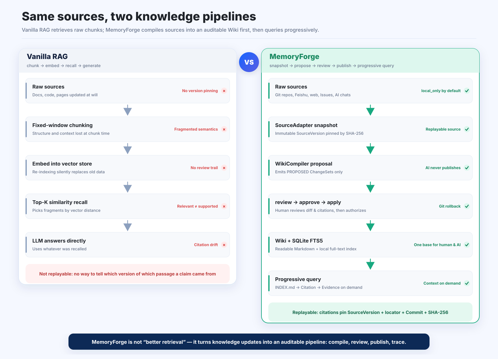
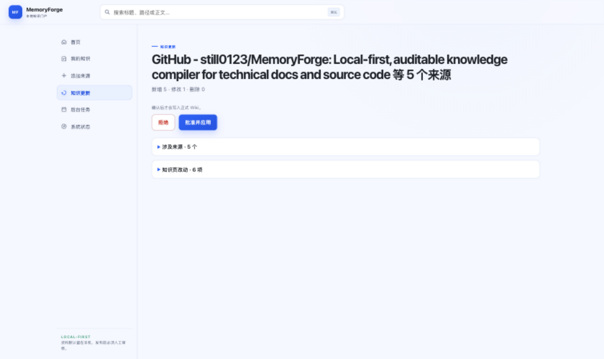
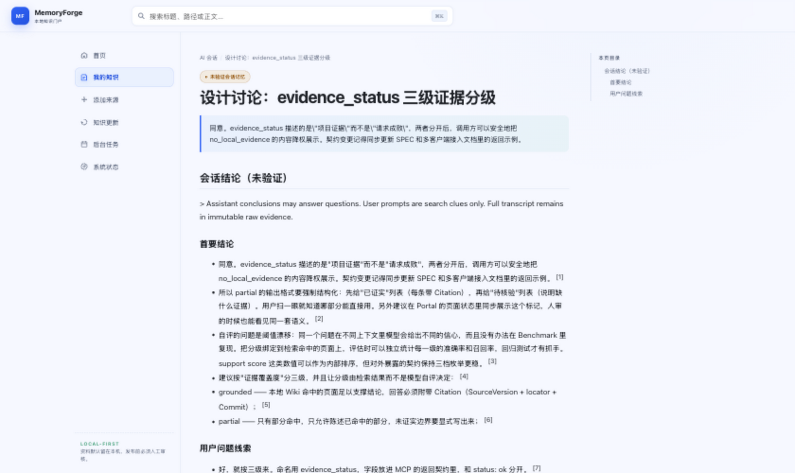
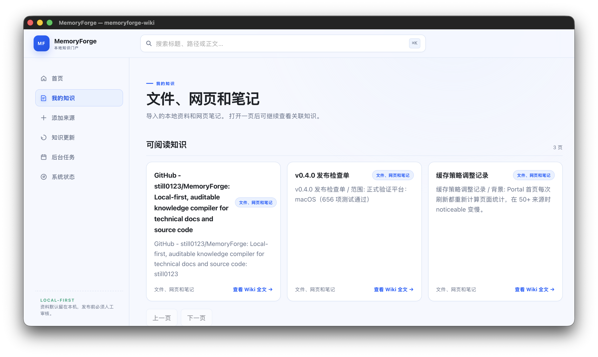
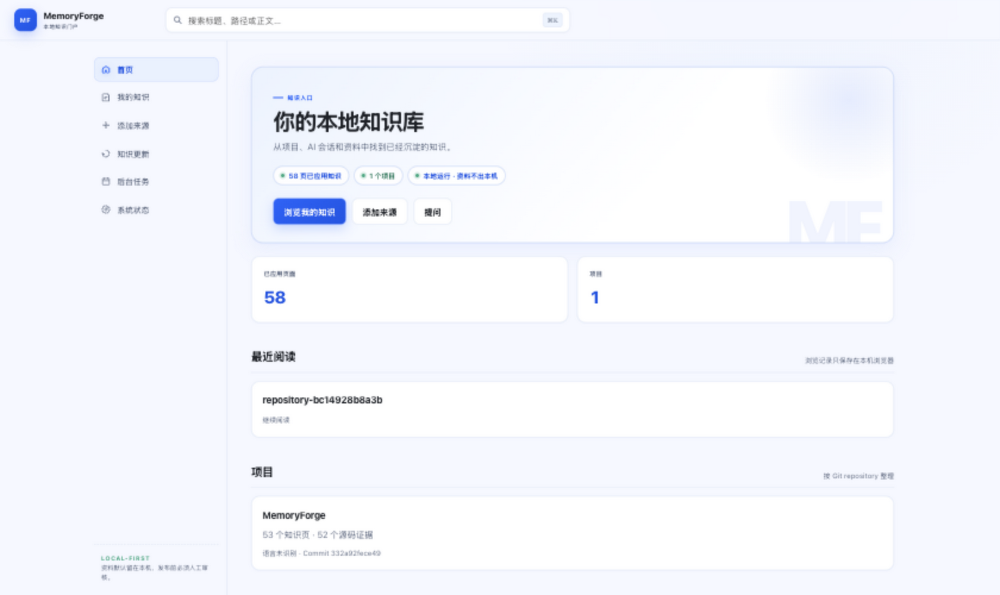

<!-- memoryforge-release-claim: version=0.4.0; status=released; supported_platforms=macos; macos_passed=656; linux_status=not_rerun; windows_status=not_verified; release_verification=passed -->

<div align="center">


# MemoryForge

**Compile code, docs, and AI conversations into an auditable, traceable local wiki.**

A local-first knowledge compiler — AI can only propose changes; humans review before anything is published, and every claim traces back to its source.

<a href="https://github.com/still0123/MemoryForge/releases/tag/v0.4.0"></a>
<a href="LICENSE"></a>


[Quick Start](#quick-start) · [vs. Vanilla RAG](#vs-vanilla-rag) · [Design Decisions](#design-decisions) · [Use in AI Apps](#use-in-ai-apps)

[English] | **简体中文** ([README.md](README.md))

</div>

---

## The Problem It Solves

Giving AI coding assistants access to project knowledge usually means one of two trade-offs:

- **Dump documents into the context window** — expensive, noisy, and stale within days;
- **Build a RAG pipeline** — chunk-recalled answers cannot be traced, and nobody reviews index updates.

MemoryForge takes a **compilation** approach: it turns Git repositories, Markdown/TXT/HTML,
Feishu docs, public web pages, GitHub Issues/PRs, and AI conversations into a single
human-readable, Git-versioned Markdown Wiki. AI can only generate proposals (ChangeSets);
a human reviews before anything is published — and every claim can be replayed against the
exact version of its source. The output is still plain Markdown, Git history, and a local
SQLite index.

| Capability | What it means |
| --- | --- |
| **Auditable updates** | Generate → review → approve → apply are separate steps; AI can never modify the published wiki directly |
| **Traceable claims** | Citations pin the SourceVersion, source locator, Git commit, and SHA-256 |
| **Context on demand** | `INDEX.md` + SQLite FTS5 locate pages first; source evidence is expanded only when verification is needed |
| **No guessing without evidence** | Three-level `evidence_status`: `grounded / partial / no_local_evidence` |
| **Selective session recall** | Past conversations are clustered by topic and loaded on demand |
| **One entry point for many clients** | Codex, Claude Code, and Gemini share a single local MCP server |
| **Local-first** | Git, Feishu, code, and conversation sources are `local_only` by default; your data stays on your machine |

## vs. Vanilla RAG



| Vanilla RAG | MemoryForge |
| --- | --- |
| Recalls raw chunks directly | Compiles sources into a readable, auditable, versioned wiki first |
| Updates silently replace the index | Generates a ChangeSet, then `review → approve → apply` |
| Answers whenever a topic seems related | Preserves boundaries when evidence is insufficient; never invents project facts |
| Hard to replay a past answer | Citations pin the source version, locator, commit, and SHA-256 |

## Design Decisions

The key trade-offs behind the project — also the shortest path to understanding it.

**Why are `approve` and `apply` separate steps?**
`approve` records an authorization bound to the proposal hash; only `apply` writes to the
wiki and creates a Git commit. Review, authorization, and persistence can therefore be
audited and replayed independently. When something goes wrong, reverting the commit never
erases the authorization record. Automatic updates cannot bypass this chain either.

**Why does a citation pin a SHA-256?**
Paths move, links rot, and documents get rewritten — content hashes do not change. A
citation pins the SourceVersion, the source locator, the commit, and the SHA-256 together,
so any historical claim can be replayed locally against the exact passage it was based on.

**Why SQLite FTS5 instead of a vector database?**
Wiki pages are compiled artifacts, not raw chunks: they are few in number and carry strong
title/structure semantics. Full-text search locates pages reliably, is fully explainable,
and requires zero external services. Vector databases are on the non-goal list (see below).

**Why a three-level `evidence_status`?**
It forces the model to separate "conclusions backed by local evidence" from "generic
guesses": `grounded` must include citations; `partial` states only the verified parts and
marks the boundary; `no_local_evidence` explicitly says the wiki has no such project fact —
it may never be disguised as a project conclusion.

## Quick Start

Requires Python 3.11+. The officially verified platform for v0.4.0 is macOS.

```bash
git clone https://github.com/still0123/MemoryForge.git
cd MemoryForge

python3.11 -m venv .venv
source .venv/bin/activate
python -m pip install .

memoryforge init ./my-wiki
memoryforge start --workspace ./my-wiki
```

> If installing from PyPI with `python -m pip install memoryforge-wiki` fails (mirror lag or unpublished package), use the source installation above.

The portal binds to `127.0.0.1` only. In the browser, follow "add source → background task →
knowledge update → approve & apply" to ingest your first material, then search or ask from
the home page. Minimal CLI flow:

```bash
memoryforge import /absolute/path/to/design.md --workspace ./my-wiki
memoryforge ingest --pending --workspace ./my-wiki
memoryforge review <changeset-id> --workspace ./my-wiki
memoryforge approve <changeset-id> --workspace ./my-wiki
memoryforge apply <changeset-id> --workspace ./my-wiki
memoryforge ask 'Why was this project designed this way?' --workspace ./my-wiki
```

Recompiling all current AI conversations (including applied ones) still only produces
pending ChangeSets:

```bash
memoryforge recompile conversations --workspace ./my-wiki
memoryforge recompile conversations --workspace ./my-wiki --trae --allow-local-llm
```

`--trae` pins the `gpt-5.6-sol__max` model at `xhigh` reasoning effort; it sends local
conversations to that model and therefore requires explicit authorization. Both modes only
generate `PROPOSED` ChangeSets — nothing is auto-published.

## How It Works

### Publishing knowledge

SourceAdapters store immutable source versions; the WikiCompiler only produces pending
ChangeSets. `review` shows the diff, citations, and impact; `approve` records an independent
authorization; `apply` writes to the wiki, updates the index, and creates a revertible Git
commit. Automatic updates cannot bypass this chain.


The real review UI — one ChangeSet aggregating five sources (a web page, two AI sessions, two notes); nothing is written to the formal wiki before `approve`:



### Querying knowledge

A query first locates a handful of relevant pages via `INDEX.md` and SQLite FTS5, then reads
citations; only when verification is needed does it expand the underlying source evidence —
no need to stuff the entire wiki or every conversation into each new context.


AI conversations are compiled into structured pages (overview / key conclusions / applicability) and flagged as "unverified conversation memory" — important conclusions still defer to current code and formal evidence:



Successful MCP calls uniformly return `status: ok`; project evidence is reported separately
via `evidence_status`:

| `evidence_status` | Meaning |
| --- | --- |
| `grounded` | Local evidence supports the project conclusion, with citations returned |
| `partial` | States only the supported parts and marks the unverified boundary |
| `no_local_evidence` | The wiki holds no such project fact; generic analysis is allowed but must not be presented as a project conclusion |

When you ask a question in an AI app, MemoryForge does not dump the wiki into the context.
It runs a progressive, bounded query chain: locate pages → read summaries → expand sources
only when needed → let the AI synthesize an answer from the returned citations.


## Ways to Use

| Entry point | Best for |
| --- | --- |
| **macOS / Windows desktop app** | Daily browsing, adding sources, reviewing updates |
| **Local portal** | The complete workflow in the browser |
| **CLI** | Batch processing, automation, diagnostics |
| **Codex / Claude Code / Gemini MCP** | On-demand access to reviewed knowledge and past sessions in chat |



<sub>Real macOS desktop screenshot (dogfooding: the wiki holds the MemoryForge repo itself, two AI design/debugging sessions, a web page, and notes).</sub>

The local portal serves the same UI in the browser:



<sub>The portal binds to `127.0.0.1` only; your data stays local by default.</sub>

The macOS desktop app is the recommended daily driver:

```bash
python -m pip install ".[desktop]"
memoryforge-desktop
```

Windows builds require a Windows 10/11 host; the artifact is a single-file `dist\MemoryForge.exe`:

```powershell
py -3.11 -m venv .venv
.\.venv\Scripts\python.exe -m pip install -e ".[desktop]"
.\.venv\Scripts\memoryforge.exe init .\my-wiki
powershell -ExecutionPolicy Bypass -File .\scripts\build_windows_app.ps1
.\dist\MemoryForge.exe
```

> An official Windows release still requires the native Windows gate; see the [desktop guide](docs/DESKTOP_APP_CN.md) for details.

## Use in AI Apps

Register the global MCP router once per workspace, and Codex, Claude Code, and Gemini can
all reach the reviewed wiki through the same local server. The currently open project
directory is only a ranking hint, not an access boundary.

**1. Connect once:**

```bash
memoryforge connect codex --workspace /absolute/path/to/my-wiki   # Codex (recommended)
memoryforge connect claude --workspace /absolute/path/to/my-wiki  # Claude Code
claude mcp list                                                    # verify

python -m memoryforge client plan gemini \                         # Gemini
    --workspace /absolute/path/to/my-wiki \
    --project /absolute/path/to/your-project
# follow the printed instructions to run: gemini mcp add ...
```

The connect command registers one local MCP server plus a small skill describing when to
call it — no per-repository re-registration, and it never rewrites your project's
`AGENTS.md` or `.mcp.json`. Only `public` sources are exposed to AI by default; reading
`local_only` content (private code, private Feishu docs, session records) requires an
explicit `--allow-local-llm` at connect time. Restart the client and confirm `memoryforge`
shows up via `/mcp` (Codex/Claude).

**2. Just ask — no wiki pasting:**

```text
Why does this project separate approve from apply?
Why did the caching strategy change recently?
Check MemoryForge first, then explain this module's design constraints.
```

When a question touches project history, design decisions, or existing docs, the AI calls
`memoryforge_context` to read a few relevant wiki pages; to verify source details it calls
`memoryforge_read_evidence` to expand the exact locator — it never scans the entire raw
material library.

**3. Load a specific past session:** `memoryforge_episodes` clusters recent conversations
by topic and returns only topics, short summaries, and references; `memoryforge_load_session`
then injects a size-capped Episode Capsule into the current conversation — old history is
never auto-injected into every new task. Important conclusions should still be confirmed
against current code, tests, or formal wiki evidence.

**4. Optional, auto-prepare context for the next task:** with the SessionStart Hook enabled,
run `memoryforge continue` in the target directory, pick the topic to resume, and start a
new task. Capsules are unverified historical hints and are never written to the formal wiki.

```bash
memoryforge connect codex --startup-hook --workspace /absolute/path/to/my-wiki
# Claude Code works the same: memoryforge connect claude --startup-hook ...
```

**5. What evidence-based answers look like:**

```text
You: Check MemoryForge first: why are approve and apply separate?

AI:  approve only records an authorization bound to the proposal hash; apply is what
     writes to the wiki and creates the Git commit. Review, authorization, and
     persistence can therefore be audited and replayed independently.

Source: wiki page · SourceVersion · source locator · commit SHA
```

## Documentation

| Doc | Contents |
| --- | --- |
| [User guide (Chinese)](docs/USER_GUIDE_CN.md) | Install, import, Q&A, AI-host MCP integration |
| [Multi-client setup](docs/MULTI_CLIENT_SETUP.md) | Codex / Claude Code / Gemini connection and hooks |
| [Desktop guide (Chinese)](docs/DESKTOP_APP_CN.md) | macOS / Windows app, workspace selection, packaging |
| [SPEC.md](SPEC.md) | Architecture, data model, security boundary |
| [Portfolio demo](docs/PORTFOLIO_DEMO.md) | Demo commands, tour order, follow-up questions |
| [Benchmark](docs/BENCHMARK.md) | Methodology, results, negative cases, reproduction |
| [Research archive](docs/research/README.md) | Candidates, negative results, historical evidence |
| [CHANGELOG](CHANGELOG.md) | Release scope and verification status |

## Non-Goals

MemoryForge targets individual developers, tech leads, and anyone maintaining multiple
repositories over the long run. It deliberately does not do: public SaaS, group chat,
multi-user permissions, vector databases, knowledge graphs, general-purpose coding agents,
or multi-agent orchestration. Run `memoryforge --help` for the full CLI.

## License

[MIT](LICENSE)

<!-- memoryforge-release-claim: version=0.3.0; status=released; supported_platforms=macos+linux; active_candidate=19; platform_gate_candidate=19; platform_gate_status=accepted; review_status=accepted; macos_passed=642; linux_passed=639; linux_skipped=3; windows_status=not_verified; release_verification=passed -->
