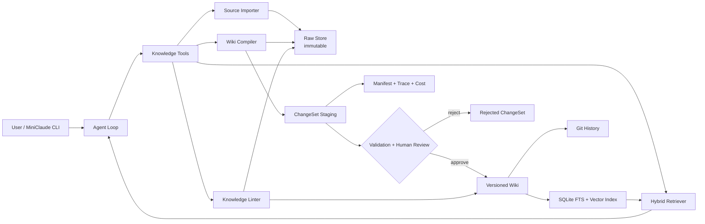

# MemoryForge 项目 Spec

> 面向个人开发者的 Git-backed、可追溯、可审阅 LLM Wiki Agent

| 字段 | 内容 |
|---|---|
| 文档状态 | Draft v0.1 |
| 项目代号 | MemoryForge |
| 产品形态 | 本地优先的 MiniClaude CLI + 个人知识库 |
| 核心模块 | 知识摄入、知识编译、变更审核、证据检索、健康巡检 |
| 首个场景 | 个人开发者的项目文档、技术方案、复盘、笔记与 Git 记录 |
| 目标周期 | 4 周完成可公开演示的 MVP |

## 1. 一句话定义

MemoryForge 是一个面向个人开发者的长期知识 Agent：它把原始文档编译成带来源、时间和交叉引用的 Wiki，在任何知识写入前生成可审阅 Diff，并通过查询与巡检持续维护知识质量。

它不是“上传文档后聊天”的普通 RAG，也不是完整复刻 Claude Code。MiniClaude 只提供轻量 Agent Loop，项目深度集中在知识生命周期。

## 2. 背景与问题

个人开发过程中会持续产生以下知识：

- PRD、技术方案和架构决策；
- Bug、事故、Oncall 与排障记录；
- 项目复盘和模块总结；
- Git Commit、Pull Request 与代码注释；
- 零散灵感、踩坑和个人偏好。

传统方案存在四个问题：

1. 文档需要人工持续分类、摘要和维护，成本高；
2. 普通 RAG 在查询时临时拼接 Chunk，跨文档综合结果不会沉淀；
3. 新旧结论发生冲突时，系统通常无法判断有效时间，也不能解释变化过程；
4. LLM 可以直接重写知识，但错误覆盖、无来源事实和不可回滚会破坏可信度。

MemoryForge 的核心命题是：

> 能否让 LLM 自动维护个人知识，同时保证每个结论可回源、每次修改可审阅、每个版本可回滚？

## 3. 产品目标

### 3.1 MVP 目标

- 支持从本地 Markdown、纯文本和 Git 仓库文档导入原始素材；
- 将素材编译为 Source、Entity、Concept、Pitfall、ADR 和 Overview 页面；
- 每条重要结论绑定来源片段、来源哈希和有效时间；
- 所有 Wiki 修改先生成 ChangeSet，由用户审核后提交；
- 支持带引用回答、跨页面综合、冲突提示和证据不足时拒答；
- 支持知识库健康巡检、版本历史和一键回滚；
- 用公开数据完成普通 Chunk RAG 与 LLM Wiki 的对比评测。

### 3.2 秋招展示目标

面试官应能在五分钟内看到：

1. 导入三份相互关联且存在版本变化的项目文档；
2. 系统生成 Wiki 变更预览并指出冲突；
3. 用户审核后提交；
4. Agent 回答“当前方案是什么、过去为什么不同”，并给出来源；
5. 回滚一次错误摄入；
6. 展示与普通 RAG 的量化对比结果。

### 3.3 非目标

MVP 明确不做：

- 完整 Claude Code 工具链和通用编码 Agent；
- 多 Agent 编排；
- 团队协作、RBAC 和多租户；
- Neo4j 等独立图数据库；
- 飞书、Notion、Obsidian 的全部同步能力；
- PDF OCR、音视频解析和多模态知识库；
- 自动执行不可逆知识修改；
- 训练或微调模型。

## 4. 目标用户与首个领域

### 4.1 目标用户

有多个长期项目、经常跨会话使用 AI、希望沉淀技术决策和排障经验的个人开发者。

### 4.2 首个知识领域

只服务“个人开发知识”，优先支持：

- `design/`：技术方案、架构决策；
- `postmortem/`：事故与复盘；
- `summary/`：项目或模块完整画像；
- `notes/`：踩坑、决策、灵感；
- `refs/`：公开外部资料；
- Git 仓库中的 README、ADR 和 Changelog。

不在 MVP 中支持泛化的生活、医疗、财务等个人知识。

## 5. 核心设计原则

### 5.1 三层知识结构

| 层 | 所有者 | 规则 |
|---|---|---|
| Schema | 用户与 Agent 共同维护 | 定义分类、写作纪律、阈值和隐私规则 |
| Raw | 用户所有，Agent 只读 | 原始素材不可被 Agent 原地修改 |
| Wiki | Agent 生成，用户审核 | 所有更新必须经过 ChangeSet |

### 5.2 摄入时编译

知识在 `ingest` 阶段完成摘要、事实提取、实体关联、冲突检测和交叉引用；查询阶段优先读取已经整理过的 Wiki，而不是每次从全部原文重新推理。

### 5.3 Evidence First

- 没有来源的事实不得作为确定结论写入 Wiki；
- 引用必须绑定 Source、内容哈希和原文定位；
- 无法确认的信息标记为 `UNVERIFIED` 或 `TODO`；
- 查询证据不足时必须明确拒答。

### 5.4 Stage Before Write

LLM 不直接修改稳定 Wiki。所有写入先形成 ChangeSet：

`PROPOSED → VALIDATED → APPROVED → APPLIED`

用户可在 `PROPOSED` 或 `VALIDATED` 阶段修改、拒绝或拆分变更。

### 5.5 Local First

Raw、Wiki、索引和审计记录默认保存在本地。模型调用通过 OpenAI-compatible Provider Adapter 接入，并在调用前完成敏感信息扫描和预算检查。

## 6. 核心用户旅程

### 6.1 初始化

```bash
memoryforge init ./my-wiki
```

系统创建目录、默认 Schema、Git 仓库和本地索引。

### 6.2 导入素材

```bash
memoryforge import ./docs/design-v1.md --category design
memoryforge import ./docs/incident.md --category postmortem
```

导入后：

- 原文件复制到 `raw/`；
- 计算 SHA-256；
- 记录来源、时间、媒体类型和用户标签；
- 相同内容重复导入时保持幂等。

### 6.3 编译知识

```bash
memoryforge ingest --pending
```

系统读取未处理 Source，生成一个 ChangeSet：

- 新建或更新哪些 Wiki 页面；
- 提取了哪些 Claim；
- 引用了哪些原文片段；
- 发现了哪些冲突；
- 删除或废弃了哪些旧结论；
- 预计产生多少模型费用。

### 6.4 审核并提交

```bash
memoryforge review <changeset-id>
memoryforge apply <changeset-id>
```

`review` 显示结构化 Diff。只有通过验证并被用户批准的 ChangeSet 才能写入稳定 Wiki 和 Git 历史。

### 6.5 查询

```bash
memoryforge ask "缓存键设计现在采用什么方案？为什么放弃上一版？"
```

回答必须包含：

- 当前有效结论；
- 历史变化；
- 来源文件和片段；
- 不确定性或冲突；
- 本次检索 Trace 摘要。

### 6.6 巡检

```bash
memoryforge lint
```

检查：

- 无来源 Claim；
- 过期但仍被标记为当前的 Claim；
- 相互矛盾且未解决的 Claim；
- 孤立页面和断链；
- 内容重复；
- Raw 已更新但 Wiki 尚未重新编译；
- 引用哈希失效；
- 长期未复核的低置信度结论。

### 6.7 回滚

```bash
memoryforge history
memoryforge rollback <commit-id>
```

回滚恢复 Wiki 与 Manifest；Raw 默认不删除，只通过 Tombstone 标记失效。

## 7. 功能需求

| ID | 需求 | 优先级 | MVP 验收标准 |
|---|---|---:|---|
| FR-01 | 初始化 Wiki Workspace | P0 | 一条命令生成目录、Schema、Git 和索引 |
| FR-02 | 导入本地素材 | P0 | Markdown/Text 可导入，重复导入幂等 |
| FR-03 | Source 不可变存档 | P0 | 内容哈希、来源和时间完整记录 |
| FR-04 | Wiki 编译 | P0 | 能从 Source 生成至少 5 类 Wiki 页面 |
| FR-05 | Claim 与 Citation | P0 | 每个确定 Claim 至少有一条有效 Citation |
| FR-06 | ChangeSet Diff | P0 | 新增、修改、废弃与冲突均可预览 |
| FR-07 | 人工审核门 | P0 | 未批准 ChangeSet 不能写稳定 Wiki |
| FR-08 | 带引用查询 | P0 | 回答包含引用和当前/历史有效性 |
| FR-09 | Lint | P0 | 至少检测无来源、断链、冲突、过期四类问题 |
| FR-10 | Git 版本与回滚 | P0 | 可恢复到任一已应用 ChangeSet |
| FR-11 | 混合检索 | P1 | BM25 + Embedding，可解释候选得分 |
| FR-12 | Git 文档导入 | P1 | 可绑定仓库、Commit SHA 和文件路径 |
| FR-13 | 查询结果回流 | P1 | 有价值回答可形成新的待审核 ChangeSet |
| FR-14 | 静态本地报告 | P1 | 输出 HTML 健康度与评测报告 |
| FR-15 | 飞书适配器 | P2 | 仅作为可插拔 Source Adapter |

## 8. 系统架构



### 8.1 组件职责

| 组件 | 职责 |
|---|---|
| MiniClaude Agent Loop | 理解自然语言意图，选择知识工具，生成最终回答 |
| Source Importer | 导入、去重、分类、哈希和敏感信息预检 |
| Wiki Compiler | 提取 Claim、实体、概念、关系与候选页面 |
| ChangeSet Validator | 校验引用、格式、冲突、覆盖和 Schema 约束 |
| Review Gate | 展示 Diff，接收批准、修改、拆分或拒绝 |
| Hybrid Retriever | BM25、向量召回、链接邻域和新鲜度重排 |
| Knowledge Linter | 健康检查和修复建议 |
| Version Store | Git 版本、Manifest、回滚和审计 |
| Provider Adapter | 统一不同 OpenAI-compatible 模型调用 |

## 9. Workspace 目录

```text
my-wiki/
├── AGENTS.md
├── raw/
│   ├── design/
│   ├── postmortem/
│   ├── summary/
│   ├── notes/
│   └── refs/
├── wiki/
│   ├── INDEX.md
│   ├── sources/
│   ├── entities/
│   ├── concepts/
│   ├── pitfalls/
│   ├── adrs/
│   ├── comparisons/
│   └── overviews/
└── .memoryforge/
    ├── config.yaml
    ├── manifests/
    ├── staging/
    ├── rejected/
    ├── traces/
    ├── index.sqlite
    └── vectors/
```

### 9.1 AGENTS.md 最小内容

- 项目背景和知识边界；
- Raw 子目录用途；
- Wiki 页面类型及建页阈值；
- 写作纪律；
- 引用和不确定性规则；
- 隐私和禁入目录；
- 用户个人偏好。

默认文件控制在 50 行以内，避免规则本身成为维护负担。

## 10. 核心数据模型

### 10.1 SourceDocument

```yaml
source_id: src_xxx
uri: raw/design/cache-v2.md
content_sha256: ...
media_type: text/markdown
category: design
imported_at: ...
observed_at: ...
supersedes_source_id: null
sensitivity: public
```

### 10.2 Claim

```yaml
claim_id: clm_xxx
subject: cache-key
predicate: uses
object: namespaced-hash-key
status: VERIFIED
confidence: 0.96
valid_from: 2026-07-01
valid_to: null
supersedes_claim_id: clm_old
citations:
  - source_id: src_xxx
    quote_sha256: ...
    locator: lines:42-48
```

### 10.3 ChangeSet

```yaml
changeset_id: chg_xxx
base_commit: ...
source_ids: [src_xxx]
status: VALIDATED
operations:
  - type: UPDATE_PAGE
    path: wiki/adrs/cache-key.md
validation:
  citation_coverage: 1.0
  unresolved_conflicts: 0
  schema_errors: 0
model:
  provider: ...
  model: ...
  input_tokens: ...
  output_tokens: ...
```

### 10.4 LintIssue

```yaml
issue_id: lint_xxx
severity: HIGH
kind: STALE_CLAIM
target_id: clm_xxx
evidence: [...]
suggested_action: MARK_SUPERSEDED
```

## 11. 知识编译流程

`ingest` 必须按以下顺序执行：

1. 读取 Source 与 Schema；
2. 计算 Source Diff，识别新增、更新或重复内容；
3. 提取候选 Claim 和 Citation；
4. 识别 Entity、Concept、ADR、Pitfall 和 Overview；
5. 检索已有 Wiki，寻找相关页面和潜在冲突；
6. 生成页面级与 Claim 级操作；
7. 运行确定性校验；
8. 生成 ChangeSet 和 Diff；
9. 等待人工审核；
10. 应用后写入 Git Commit、更新索引和审计记录。

### 11.1 确定性校验

不依赖 LLM Judge 的基础门禁：

- 引用 Source 必须存在；
- 引用哈希必须匹配；
- `VERIFIED` Claim 必须有 Citation；
- 页面路径必须符合 Schema；
- 不允许修改 `raw/`；
- ChangeSet 的 `base_commit` 必须仍是当前版本；
- 相同 Source 重放必须幂等；
- 未解决高危冲突时禁止自动 Apply。

## 12. 检索与回答策略

### 12.1 检索阶段

1. Query 分类：事实、综合、历史、对比或未知；
2. 从 `INDEX.md` 和 FTS5 召回页面；
3. 可选向量召回补充语义相似结果；
4. 扩展一跳交叉引用；
5. 依据关键词、语义、新鲜度、Citation 完整度进行重排；
6. 加载候选 Claim 和必要原文片段。

### 12.2 回答纪律

- 当前问题优先采用 `valid_to = null` 的有效 Claim；
- 历史问题必须按照时间过滤；
- 存在未解决冲突时同时展示两侧证据；
- 每个关键结论提供 Citation；
- 没有足够证据时回答“不知道”，并建议补充哪类 Source；
- 不因聊天内容自动修改稳定 Wiki，只能生成待审核 ChangeSet。

## 13. MiniClaude 工具接口

MVP 只开放六个工具：

```text
kb_import(path, category, tags)
kb_ingest(source_ids)
kb_review(changeset_id, decision, edits)
kb_query(question, as_of, filters)
kb_lint(scope, severity)
kb_history(target)
```

工具返回结构化 JSON；Agent 负责解释结果，不直接访问底层数据库。

## 14. CLI 设计

```bash
memoryforge init <workspace>
memoryforge import <path> [--category ...]
memoryforge ingest [--pending | --source ...]
memoryforge review <changeset-id>
memoryforge apply <changeset-id>
memoryforge reject <changeset-id>
memoryforge ask "<question>" [--as-of YYYY-MM-DD]
memoryforge lint [--fix-proposal]
memoryforge history [--page ...]
memoryforge rollback <commit-id>
memoryforge eval <eval-config>
```

默认用户路径只突出：

`import → ingest → review → ask → lint`

其他命令放入 Advanced 文档，避免 CLI 再次膨胀。

## 15. 技术选型

| 领域 | MVP 选择 |
|---|---|
| 语言 | Python 3.11+ |
| CLI | Typer |
| 数据契约 | Pydantic v2 |
| 稳定知识存储 | Markdown + Git |
| 元数据与关键词索引 | SQLite + FTS5 |
| 向量检索 | 可插拔 Embedding Adapter，本地文件保存向量 |
| 模型接入 | OpenAI-compatible API |
| 配置 | YAML |
| 测试 | pytest |
| 质量 | Ruff、mypy、GitHub Actions |
| 报告 | 静态 HTML，MVP 后半程实现 |

MVP 不引入 LangChain、LlamaIndex 或图数据库；核心编排、数据契约和生命周期由项目自行实现。

## 16. 安全与隐私

- 默认拒绝导入 `.env`、密钥文件、凭证目录和二进制数据库；
- 支持 `.memoryforgeignore`；
- Provider 仅继承显式允许的环境变量；
- 模型请求前执行 Secret Pattern 扫描；
- Trace 不保存 API Key 和完整敏感原文；
- 用户可将 Source 标记为 `local_only`，此类内容不得发送给远程模型；
- 删除采用 Tombstone，真正清除需要显式高风险确认；
- 公开 Demo 只能使用自有或开源资料，禁止使用公司内部文档。

## 17. 可观测性

每次 Import、Ingest、Query、Lint 记录：

- 输入 Source 和内容哈希；
- Provider、模型、Token、延迟和估算费用；
- 检索候选及各阶段得分；
- 使用过的 Claim 和 Citation；
- ChangeSet 状态变化；
- 错误、重试与终止原因。

Trace 用于调试与评测，但不默认保存完整模型思维过程。

## 18. 评测方案

### 18.1 对比基线

Baseline：原始文档 Chunk + BM25/向量召回的普通 RAG。

Treatment：MemoryForge 的 Wiki 编译、Claim、时间状态和引用链。

两组固定相同模型、问题、原始材料和 Token 预算，只改变知识组织方式。

### 18.2 公开评测集

从一个公开开源项目构造 40–50 个问题：

| 类型 | 示例 | 重点指标 |
|---|---|---|
| 单文档事实 | 某配置默认值是什么 | Answer Accuracy |
| 跨文档综合 | 某方案经历了哪些变化 | Synthesis Accuracy |
| 时间问题 | 2025 年与当前方案分别是什么 | Temporal Accuracy |
| 冲突问题 | 两份文档结论冲突时哪个有效 | Conflict Resolution |
| 来源问题 | 为什么做出该决策 | Citation Precision/Recall |
| 不可回答 | 文档未提供某信息 | Abstention Accuracy |

### 18.3 核心指标

- Answer Accuracy；
- Citation Precision / Recall；
- Temporal Accuracy；
- Stale Answer Rate；
- Conflict Detection Rate；
- Abstention Accuracy；
- Ingest Idempotency；
- Wiki Update Precision；
- 平均 Token、延迟和费用。

### 18.4 发布门

MVP 对外展示必须满足：

- 所有 P0 确定性测试通过；
- 关键回答 Citation Precision ≥ 0.9；
- 时间类问题准确率显著高于普通 RAG 基线；
- 重复 Ingest 不产生额外 Wiki Diff；
- 错误 ChangeSet 可以完整回滚；
- Demo 数据无内部或敏感信息。

`AgentSkill-Eval` 可以作为外部评测器复用，但 MemoryForge 的运行时不得依赖它。

## 19. 测试策略

### 19.1 单元测试

- Source 哈希和去重；
- Claim 状态转换；
- Citation 定位与校验；
- ChangeSet 状态机；
- Schema 校验；
- 检索过滤与时间条件；
- Lint 规则；
- Git Commit 和回滚。

### 19.2 集成测试

- 三份文档导入到 Wiki 提交；
- 新版本文档使旧 Claim 过期；
- 冲突 Source 阻止自动 Apply；
- Query 返回当前结论与历史结论；
- 失败的模型响应不污染稳定 Wiki；
- 中断后可恢复未完成 ChangeSet。

### 19.3 Golden 测试

固定 Source、Schema 和模型 Mock，验证生成的 ChangeSet 结构、操作集合与引用覆盖率。

## 20. 四周里程碑

### Week 1：可信存储骨架

- Workspace、Schema、Raw、Manifest；
- Import、哈希、去重；
- Git 初始化与基本回滚；
- SQLite/FTS5 索引；
- CI、Ruff、mypy、pytest。

交付：无需模型即可导入、索引、查询原始 Source。

### Week 2：Wiki Compiler 与 Review Gate

- Claim/Citation 数据模型；
- Source → Wiki 编译；
- ChangeSet、Diff 和状态机；
- 确定性校验；
- 人工 Apply/Reject。

交付：三份公开文档可以生成并提交一个可审计 Wiki。

### Week 3：Agent Query 与 Lint

- MiniClaude Agent Loop；
- 混合检索；
- 当前/历史问题；
- 引用回答和拒答；
- 四类核心 Lint；
- 查询 Trace。

交付：完成五分钟端到端 Demo。

### Week 4：评测与作品包装

- 构造公开评测集；
- 普通 RAG Baseline；
- 运行对比实验；
- 静态结果报告；
- 精简 README、录制 GIF/视频；
- 发布 `v0.1.0`。

交付：GitHub 首页能展示问题、方案、真实结果和一条命令 Demo。

## 21. Demo 脚本

公开 Demo 使用虚构或开源项目资料：

1. 导入 `cache-design-v1.md`；
2. 导入 `incident-postmortem.md`；
3. 导入 `cache-design-v2.md`，其中推翻 v1 的部分决定；
4. 执行 `ingest`，查看系统生成的过期 Claim 和新 ADR；
5. 审核并 Apply；
6. 提问“当前缓存键方案是什么？”；
7. 提问“v1 为什么被放弃？”；
8. 故意摄入一份冲突文档，展示 Apply 被阻断；
9. 执行 `lint`；
10. 展示普通 RAG 与 MemoryForge 的对比报告。

## 22. 秋招项目表述

### 22.1 简历版

> 设计并实现 Git-backed 个人知识 Agent，将项目文档编译为带来源与有效时间的长期 Wiki；通过 ChangeSet 审核、确定性引用校验、冲突检测和版本回滚避免 LLM 直接写库造成知识污染，并构建公开评测集对比普通 RAG 在时序问答、引用准确率与过期信息处理上的表现。

### 22.2 面试主线

重点讲清楚三个问题：

1. 为什么 Query-time RAG 无法形成可持续知识复利；
2. 为什么 LLM 写知识必须经过证据校验、Diff 和人工门禁；
3. 如何用时间状态、来源哈希和回滚保证长期知识可信。

不把功能数量作为亮点，重点展示数据模型、状态机、失败场景和评测结果。

## 23. 后续版本

仅在 MVP 完成后考虑：

- 飞书 Doc/Drive Source Adapter；
- Obsidian Vault Adapter；
- GitHub PR、Issue 和 Commit Adapter；
- 双向链接图和时间图谱；
- 本地模型与本地 Embedding；
- 增量后台 Ingest；
- 团队协作、权限和审批；
- 使用 AgentSkill-Eval 自动评测不同知识组织 Skill。

## 24. 关键风险

| 风险 | 表现 | 缓解 |
|---|---|---|
| 再次做成大平台 | Adapter、场景和命令不断增加 | 四周内只接受 P0/P1，严格执行非目标 |
| LLM 生成 Wiki 不稳定 | 页面结构和粒度漂移 | Schema + Golden 测试 + ChangeSet Review |
| 引用看似存在但不支持结论 | Citation 与 Claim 语义不匹配 | 规则校验 + 评测集人工标注 |
| 向量检索抢占开发时间 | 花大量时间调数据库 | 先 FTS5，Embedding 作为 P1 |
| 没有量化结果 | 项目只剩漂亮架构 | Week 4 必须交付 Baseline 对比 |
| 公开数据泄密 | 将个人工作资料提交 GitHub | Demo 仅使用虚构或开源材料 |

## 25. 最终完成定义

只有同时满足以下条件，项目才算完成：

- 一条明确主线，没有多 Agent、团队平台和泛场景扩张；
- P0 功能全部可通过 CLI 演示；
- Raw 不可变、Wiki 写入必须审核、版本可回滚；
- 查询能够处理来源、时间、冲突和拒答；
- 至少一组可复现的 Baseline 对比结果；
- README 前 100 行内包含一句话、架构、结果表和 Quickstart；
- 公开仓库不包含任何公司内部数据。

## 参考思想

- [Mem0](https://github.com/mem0ai/mem0)
- [Graphiti](https://github.com/getzep/graphiti)
- [Letta Code](https://github.com/letta-ai/letta-code)
