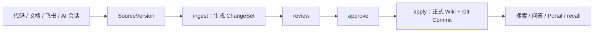

# MemoryForge 中文使用指南

这份文档面向第一次使用 MemoryForge 的个人开发者。它说明如何建立本地技术 Wiki、导入不同
来源、编译和审核知识、保存 AI 会话，以及在新 Codex 对话中按需加载历史记忆。

MemoryForge 的基本原则：**来源先保存，Wiki 再编译，变更先审核，回答必须能回到证据。**

## 1. 先理解三个对象

### Source

Source 是一次不可变的来源快照，例如一份 Markdown、一个 Git Commit 下的代码文件、一篇飞书
文档或一段 Codex 会话。来源更新时，MemoryForge 新增 SourceVersion，不覆盖历史版本。

### ChangeSet

ChangeSet 是待审核的 Wiki 变更。导入资料不会直接修改正式 Wiki；编译器先生成 ChangeSet，用户
查看内容后再批准。

### Wiki

Wiki 是已经应用的 Markdown 知识。CLI、飞书机器人、Agent、本地 Portal 和 `recall` 只把正式
Wiki 当成可信查询入口；待审核草稿不会悄悄进入回答。



## 2. 安装

要求：Python 3.11+。v0.4.0 已验证 macOS；Linux 本版本未重跑，Windows 尚未验证。

```bash
git clone https://github.com/still0123/MemoryForge.git
cd MemoryForge

python -m venv .venv
source .venv/bin/activate
python -m pip install -e '.[dev]'

memoryforge --version
```

若终端提示 `command not found: memoryforge`，通常是虚拟环境未激活。可重新执行：

```bash
source /absolute/path/to/MemoryForge/.venv/bin/activate
```

或直接使用绝对路径：

```bash
/absolute/path/to/MemoryForge/.venv/bin/memoryforge --version
```

下文统一使用 `memoryforge`。

## 3. 创建第一个 Workspace

Workspace 是你的本地知识库。它可以放在任何不与原项目重叠的目录：

```bash
memoryforge init /absolute/path/to/my-wiki
```

后续命令都明确传入同一个 Workspace，避免把资料导进错误目录：

```bash
export MF_WORKSPACE=/absolute/path/to/my-wiki
memoryforge status --workspace "$MF_WORKSPACE"
```

生成结构：

```text
my-wiki/
├── raw/                 # 不可变来源内容
├── wiki/
│   ├── INDEX.md         # Wiki 总目录
│   └── pages/           # 已应用 Markdown 页面
├── .memoryforge/        # SQLite、清单、草稿和本地状态
└── .git/                # Wiki 版本历史
```

不要把含私有来源的 Workspace 推送到公开仓库。

## 4. 最小完整流程

先导入一份 Markdown 或文本：

```bash
memoryforge import /absolute/path/to/note.md \
  --category notes \
  --local-only \
  --workspace "$MF_WORKSPACE"
```

再编译、审核、批准、应用：

```bash
memoryforge ingest --pending --workspace "$MF_WORKSPACE"
memoryforge changeset-list --workspace "$MF_WORKSPACE"

memoryforge review <changeset-id> --workspace "$MF_WORKSPACE"
memoryforge approve <changeset-id> --workspace "$MF_WORKSPACE"
memoryforge apply <changeset-id> --workspace "$MF_WORKSPACE"

memoryforge lint --workspace "$MF_WORKSPACE"
```

最后查询：

```bash
memoryforge search '关键词' --workspace "$MF_WORKSPACE"
memoryforge ask '这份资料的核心结论是什么？' --workspace "$MF_WORKSPACE"
```

`review`、`approve`、`apply` 应分开执行。不要在日常流程使用遗留的
`apply --approve` 快捷方式。

## 5. 导入本地文件和文件夹

### 单个 Markdown 或 TXT

```bash
memoryforge import /absolute/path/to/design.md \
  --category design \
  --tag architecture \
  --local-only \
  --workspace "$MF_WORKSPACE"
```

`--tag` 可以重复。敏感或个人资料建议显式使用 `--local-only`。

### 整个资料目录

```bash
memoryforge folder-import /absolute/path/to/project-docs \
  --category refs \
  --tag project-docs \
  --workspace "$MF_WORKSPACE"
```

`folder-import` 递归导入支持的 Markdown、TXT 和 HTML，不跟随符号链接。文件夹默认保留在本地
边界；只有资料明确允许发送给已配置模型时才传 `--public`。

导入后统一执行：

```bash
memoryforge ingest --pending --workspace "$MF_WORKSPACE"
```

## 6. 导入代码仓库并生成 Code Wiki

MemoryForge 不负责 clone 或 fetch。先在本机准备一个 Git checkout，并提交需要收录的代码。

### 第一步：登记仓库

```bash
memoryforge git-add /absolute/path/to/local-repository \
  --workspace "$MF_WORKSPACE"
```

命令返回稳定的 `repository_id`。也可随时查看：

```bash
memoryforge git-list --workspace "$MF_WORKSPACE"
```

Git 仓库默认 `local_only`。只有公开仓库且允许模型读取时才使用 `git-add --public`。

### 第二步：选择需要编译的代码范围

选择整个仓库：

```bash
memoryforge code-add <repository-id> . --workspace "$MF_WORKSPACE"
```

或只选一个目录：

```bash
memoryforge code-add <repository-id> src/service --workspace "$MF_WORKSPACE"
```

当前 Code Wiki 支持已提交的 Go、Python、TypeScript 和 TSX 文件。选择较小的业务模块通常比
第一次直接编译超大仓库更容易审核。

### 第三步：同步固定 Commit

```bash
memoryforge git-sync <repository-id> --workspace "$MF_WORKSPACE"
```

`git-sync` 读取已提交内容，不把未提交工作树当成正式来源。

### 第四步：编译 Code Wiki

默认使用确定性编译器：

```bash
memoryforge ingest --code-wiki <repository-id> \
  --workspace "$MF_WORKSPACE"
```

它生成项目、模块、文件、符号、依赖和 Citation 草稿。随后仍须：

```bash
memoryforge review <changeset-id> --workspace "$MF_WORKSPACE"
memoryforge approve <changeset-id> --workspace "$MF_WORKSPACE"
memoryforge apply <changeset-id> --workspace "$MF_WORKSPACE"
memoryforge lint --workspace "$MF_WORKSPACE"
```

可选的模型叙事只用于补充模块说明：

```bash
memoryforge ingest --code-wiki <repository-id> \
  --llm --allow-local-llm \
  --workspace "$MF_WORKSPACE"
```

这会把当前任务命中的 `local_only` 内容发送给已配置模型。只有你确认 Provider、网络边界和资料
授权后才运行；否则使用默认确定性编译。

## 7. 导入飞书文档

先安装并授权 `lark-cli`，确保当前账号能读取目标 Docx 或 Wiki。App Secret 和登录信息只保存在
本机配置，不写进 MemoryForge 仓库。

导入一个文档 URL 或 token：

```bash
memoryforge feishu-import \
  'https://example.feishu.cn/wiki/<token>' \
  --category notes \
  --tag feishu \
  --workspace "$MF_WORKSPACE"
```

MemoryForge 只导入你明确指定的单份文档，不会遍历整个飞书空间。长文档会按章节形成可检索来源。

然后执行正式编译流程：

```bash
memoryforge ingest --pending --workspace "$MF_WORKSPACE"
memoryforge review <changeset-id> --workspace "$MF_WORKSPACE"
memoryforge approve <changeset-id> --workspace "$MF_WORKSPACE"
memoryforge apply <changeset-id> --workspace "$MF_WORKSPACE"
```

已登记的飞书文档以后可统一刷新：

```bash
memoryforge refresh --workspace "$MF_WORKSPACE"
```

刷新只产生新 SourceVersion 或待编译资料，不自动批准 Wiki 变更。

## 8. 导入网页、保存的 HTML 和 GitHub 讨论

### 单篇公开网页

```bash
memoryforge web-import 'https://example.com/article' \
  --tag article \
  --workspace "$MF_WORKSPACE"
```

该命令读取一篇公开 HTTP(S) 页面，不登录、不抓取整个站点。

### 浏览器保存的 HTML

```bash
memoryforge html-import /absolute/path/to/article.html \
  --url 'https://example.com/article' \
  --local-only \
  --workspace "$MF_WORKSPACE"
```

它只读取指定 HTML 文件，不读取浏览器 Profile、Cookie 或历史记录。

### GitHub Issue 或 Pull Request

```bash
memoryforge github-thread-import \
  'https://github.com/owner/repository/issues/123' \
  --workspace "$MF_WORKSPACE"
```

PR 会包含公开讨论、review body 和 inline review comments。需要离线重放时，可先保存规范化 JSON：

```bash
memoryforge github-thread-import \
  'https://github.com/owner/repository/pull/123' \
  --save-json /absolute/path/to/thread.json \
  --workspace "$MF_WORKSPACE"

memoryforge github-thread-import-json /absolute/path/to/thread.json \
  --workspace "$MF_WORKSPACE"
```

这些来源导入后同样执行 `ingest → review → approve → apply`。

## 9. 收录 Codex AI 会话

Codex 本地任务通常已经保存为 rollout JSONL，不需要先把对话复制成 Wiki。MemoryForge 一次导入
一个会话文件，并过滤 system prompt、内部推理和工具输出，只保留用户与 Assistant 文本。

先定位本地会话：

```bash
find ~/.codex/sessions -name 'rollout-*.jsonl' -print
```

选择其中一个文件：

```bash
memoryforge codex-import \
  ~/.codex/sessions/YYYY/MM/DD/rollout-<id>.jsonl \
  --title '排查缓存失效问题' \
  --workspace "$MF_WORKSPACE"
```

Codex 会话始终作为 `local_only`、未验证的记忆草稿。重复导入同一 rollout 会更新同一来源，不会
制造一批重复会话。

让会话进入正式记忆：

```bash
memoryforge ingest --pending --workspace "$MF_WORKSPACE"
memoryforge review <changeset-id> --workspace "$MF_WORKSPACE"
memoryforge approve <changeset-id> --workspace "$MF_WORKSPACE"
memoryforge apply <changeset-id> --workspace "$MF_WORKSPACE"
```

会话 Wiki 主要保留：

- Assistant 结论；
- 决策和修复建议；
- 未完成事项；
- 用户问题线索；
- 可回放的原始会话引用。

历史 AI 回复仍是未验证材料。重要结论应回到引用页面、代码或原文再次核验。

## 10. 收录 Claude、Trae 或其他 AI 会话

当前没有通用的私有聊天客户端读取接口。最稳路径是从对应产品导出 Markdown 或 TXT，再导入：

```bash
memoryforge import /absolute/path/to/ai-session.md \
  --category notes \
  --tag conversation \
  --tag platform:other \
  --local-only \
  --workspace "$MF_WORKSPACE"
```

不要让 MemoryForge扫描浏览器 Profile、账号缓存或应用私有数据库。若某个平台能提供明确、稳定的
JSON 导出，再单独增加适配器。

## 11. 自动收录 Botmux 托管的 AI 会话

Botmux 可以在会话生命周期事件发生时调用 MemoryForge。把以下配置加入
`~/.botmux/data/hooks.json`，并替换绝对路径：

```json
[
  {
    "event": "topic.new",
    "command": "/absolute/MemoryForge/.venv/bin/memoryforge botmux-hook --workspace /absolute/my-wiki",
    "redact": { "fullContentEvents": ["topic.new"] }
  },
  {
    "event": "thread.reply",
    "command": "/absolute/MemoryForge/.venv/bin/memoryforge botmux-hook --workspace /absolute/my-wiki",
    "redact": { "fullContentEvents": ["thread.reply"] }
  },
  {
    "event": "outbound.send",
    "command": "/absolute/MemoryForge/.venv/bin/memoryforge botmux-hook --workspace /absolute/my-wiki",
    "redact": { "fullContentEvents": ["outbound.send"] }
  },
  {
    "event": "outbound.reply",
    "command": "/absolute/MemoryForge/.venv/bin/memoryforge botmux-hook --workspace /absolute/my-wiki",
    "redact": { "fullContentEvents": ["outbound.reply"] }
  },
  {
    "event": "session.exit",
    "command": "/absolute/MemoryForge/.venv/bin/memoryforge botmux-hook --workspace /absolute/my-wiki"
  }
]
```

执行：

```bash
botmux restart
```

Hook 只生成或更新本地会话来源，不自动执行 `approve` 或 `apply`。用户仍须定期查看待审核
ChangeSet。

## 12. 在飞书对话中收录记忆

启动 MemoryForge 飞书机器人后，可在私聊中使用：

```text
/wiki 收录
/wiki auto on
/wiki auto off
```

- `/wiki 收录`：把当前会话最近 3 轮生成一个本地记忆草稿；
- `/wiki auto on`：后续每轮持续更新该草稿；
- `/wiki auto off`：停止更新，保留已有草稿。

这些命令不会自动批准知识。之后仍需在终端执行：

```bash
memoryforge ingest --pending --workspace "$MF_WORKSPACE"
memoryforge changeset-list --workspace "$MF_WORKSPACE"
```

## 13. 新 Codex 对话如何加载旧记忆

MemoryForge 不把整个历史聊天塞进新对话。`recall` 只返回少量、已经应用的近期会话摘要、决策、
未完成事项和 Wiki Citation。

### 手动加载

在新任务开始时运行：

```bash
memoryforge recall --workspace "$MF_WORKSPACE"
```

默认最多返回 3 条近期记忆，可调整到 1 至 20：

```bash
memoryforge recall --limit 5 --workspace "$MF_WORKSPACE"
```

若状态是 `empty`，说明还没有已应用的会话 Wiki；检查是否只完成了 `codex-import`，却还没有
完成 `ingest → review → approve → apply`。

### 为某个项目接入 on-demand MCP（推荐）

对项目执行一次：

```bash
memoryforge connect codex /absolute/path/to/project \
  --workspace "$MF_WORKSPACE"
```

该命令通过 Codex 官方 CLI（`codex mcp get/add`）注册一个只读 MCP Server，并在项目
`AGENTS.md` 中安装 on-demand knowledge 指令。以后从该项目目录开始 Codex 新任务时，模型按需
调用 `memoryforge_context` / `memoryforge_read_evidence` 渐进式加载历史记忆，不再在任务开始
时运行整个 `recall`。

`connect codex` 可重复执行且幂等；已注册的 Server 命令一致时保持不变，不一致时报冲突并拒绝
覆盖。它不会直接改写 `~/.codex/config.toml`、认证文件或模型配置。连接完成后重启对应 Host，
并用 `/mcp` 检查。

本地敏感内容默认不进入模型上下文；只有显式传入 `--allow-local-llm` 的固定 Server 命令才允许
返回 `local_only` 内容。

### 其他 AI Host：复制配置（不自动改写）

只有 Codex 有官方、可验证的 CLI，所以只有 Codex 支持自动接入。Claude Code、Claude
Desktop、VS Code 和 ChatGPT Desktop 都使用可复制的配置片段；`mcp-config`
只输出文本，绝不直接改写这些 Host 的配置文件：

```bash
memoryforge mcp-config --project-root /absolute/path/to/project \
  --workspace "$MF_WORKSPACE" --format json
```

输出标准 `mcpServers` JSON，把整个 `mcpServers` 对象粘贴到：

- **Claude Code**：项目根目录 `.mcp.json`；
- **Claude Desktop**：`claude_desktop_config.json`（`mcpServers` 键）；
- **VS Code**：`.vscode/mcp.json`。

粘贴后重启对应 Host，确认 Server 出现在 MCP 列表中，再从项目目录提问验证
`memoryforge_context`。

Codex 的手动后备配置（`~/.codex/config.toml`，ChatGPT Desktop 共用同一份）使用
TOML 片段：

```bash
memoryforge mcp-config --project-root /absolute/path/to/project \
  --workspace "$MF_WORKSPACE" --format toml
```

把输出的 `[mcp_servers.*]` 块追加到 `~/.codex/config.toml`。仍然优先使用
`connect codex` 自动注册，手动片段只在 CLI 不可用时作为后备。两种方式生成的
Server 名与命令完全一致，可以互换，不会产生重复注册。

### 旧方式：`codex-setup`（兼容保留）

早期版本在项目 `AGENTS.md` 安装“每个新任务先运行 recall”的指令：

```bash
memoryforge codex-setup /absolute/path/to/project \
  --workspace "$MF_WORKSPACE"
```

该命令仍可使用，与新方式共用同一个 managed block 安装器，不会同时安装两个 MemoryForge
block。新项目请改用 `connect codex`。

若新对话不属于任何项目，没有稳定的项目 `AGENTS.md` 可读取，应手动运行 `recall`。不要为了
“全局记忆”把整个 Wiki 自动注入每次对话；这会增加无关上下文。

## 14. 自动更新已有来源

手动刷新所有已登记 Git 和飞书来源：

```bash
memoryforge refresh --workspace "$MF_WORKSPACE"
```

运行一次刷新并编译：

```bash
memoryforge watch --once --workspace "$MF_WORKSPACE"
```

持续监听：

```bash
memoryforge watch --interval 60 --workspace "$MF_WORKSPACE"
```

`watch` 只生成待审核 ChangeSet，不自动批准。推荐的维护节奏：

```text
来源更新
  -> refresh / watch
  -> changeset-list
  -> review
  -> approve
  -> apply
  -> lint
```

旧 SourceVersion 和旧 Git Commit 会保留，便于历史查询和恢复；当前版本会成为新的查询入口。

## 15. 查看和查询自己的 Wiki

### 查看状态和来源

```bash
memoryforge status --workspace "$MF_WORKSPACE"
memoryforge source-list --workspace "$MF_WORKSPACE"
memoryforge changeset-list --workspace "$MF_WORKSPACE"
memoryforge doctor --workspace "$MF_WORKSPACE"
```

### 全文搜索

```bash
memoryforge search 'CreateDataFlow' --limit 10 --workspace "$MF_WORKSPACE"
```

限定一个仓库：

```bash
memoryforge search 'CreateDataFlow' \
  --repository <repository-id> \
  --workspace "$MF_WORKSPACE"
```

### 带引用问答

```bash
memoryforge ask '这个模块负责什么？' --workspace "$MF_WORKSPACE"
```

查看检索路径或展开引用原文：

```bash
memoryforge ask '这个模块负责什么？' --debug --workspace "$MF_WORKSPACE"
memoryforge ask '这个模块负责什么？' --verify --workspace "$MF_WORKSPACE"
```

默认问答不需要模型。需要更自然的模型总结时：

```bash
memoryforge ask '这个模块负责什么？' \
  --llm --allow-local-llm \
  --workspace "$MF_WORKSPACE"
```

只有显式加入 `--allow-local-llm`，模型才可接收当前命中的 `local_only` Evidence。

## 16. 在本机网页中浏览

大型 Workspace 推荐使用本地动态 Portal：

```bash
memoryforge showcase serve \
  --workspace "$MF_WORKSPACE" \
  --port 8765
```

打开：

```text
http://127.0.0.1:8765
```

服务只绑定本机、只读、按需加载 Wiki 页面，不上传资料。终端必须保持运行；按 Ctrl+C 停止。

静态 Showcase 更适合公开 Demo 或固定证据快照：

```bash
memoryforge showcase build \
  --workspace "$MF_WORKSPACE" \
  --output /absolute/path/to/showcase
```

默认静态导出不包含 `local_only` 详情。`--include-local` 会把本地私有内容写入导出目录，只能在
你确认该目录不会分享或提交时使用。

## 17. 用 Obsidian 查看

生成 Obsidian 导航：

```bash
memoryforge obsidian-build --workspace "$MF_WORKSPACE"
```

在 Obsidian 中把整个 Workspace 作为 Vault 打开，再进入 `obsidian/Home.md`。该视图将页面分为：

- 私有过程；
- 稳定知识；
- 共享业务状态。

它只生成导航，不复制 Wiki 正文，也不改变查询索引。

## 18. 在飞书中提问

先确认 CLI 能回答：

```bash
memoryforge ask '一个已知问题' --workspace "$MF_WORKSPACE"
```

配置飞书自建应用和 `lark-cli` 后启动：

```bash
memoryforge feishu-serve --workspace "$MF_WORKSPACE"
```

默认走确定性 Wiki 查询。显式启用模型：

```bash
memoryforge feishu-serve \
  --llm --allow-local-llm \
  --workspace "$MF_WORKSPACE"
```

当前 MVP 处理飞书私聊文本。它不会自动抓取整个飞书空间，也不会因为机器人收到消息就直接修改
正式 Wiki。

## 19. 隐私边界

| 来源 | 默认边界 |
| --- | --- |
| Codex 会话 | `local_only` |
| Botmux 会话 | `local_only` |
| 飞书资料 | 本地处理 |
| Git 仓库 | `local_only`，除非 `git-add --public` |
| Folder | 本地处理，除非 `folder-import --public` |
| 单文件 / 网页 | 按命令参数；敏感资料显式传 `--local-only` |

请遵守三条规则：

1. 不把真实 Workspace、公司代码、飞书正文、AI 会话、Token 或日志提交到公开 GitHub。
2. 只有确认 Provider 和资料授权后，才组合使用 `--llm --allow-local-llm`。
3. AI 会话是未验证记忆；涉及代码、权限、财务、安全或线上操作时，必须回看 Citation。

## 20. 常见问题

### `memoryforge` 命令不存在

激活安装 MemoryForge 的虚拟环境，或使用 `.venv/bin/memoryforge` 绝对路径。

### `recall` 返回 `empty`

会话可能只导入成 Source，还没有应用。执行 `ingest`，再完成
`review → approve → apply`。

### 新代码没有进入 Wiki

确认代码已提交，并依次执行：

```bash
memoryforge git-sync <repository-id> --workspace "$MF_WORKSPACE"
memoryforge ingest --code-wiki <repository-id> --workspace "$MF_WORKSPACE"
```

### Portal 展示的不是我的资料

停止旧进程，重新使用正确的绝对 Workspace 启动：

```bash
memoryforge showcase serve --workspace "$MF_WORKSPACE" --port 8765
```

不要把公开 Demo Workspace 或临时 Showcase 目录当成个人 Workspace。

### 导入后问答仍找不到

依次检查：

```bash
memoryforge source-list --workspace "$MF_WORKSPACE"
memoryforge changeset-list --workspace "$MF_WORKSPACE"
memoryforge lint --workspace "$MF_WORKSPACE"
memoryforge search '关键词' --workspace "$MF_WORKSPACE"
```

来源存在但未应用时，先完成审核流程。来源已经应用但搜索不到时，再检查问题措辞和来源正文。

## 21. 推荐日常用法

首次建立：

```text
init
  -> 导入文档和仓库
  -> ingest
  -> review / approve / apply
  -> connect codex
  -> showcase serve
```

每天或每周维护：

```text
codex-import 或自动会话 Hook
  -> refresh / watch --once
  -> changeset-list
  -> review / approve / apply
  -> lint
```

新任务开始：

```text
recall
  -> 根据任务 search / ask
  -> 核验 Citation
  -> 完成后再次收录有价值的会话
```

到这里已经覆盖 MemoryForge 的完整个人使用闭环。更多实现边界见
[`LOCAL_DYNAMIC_PORTAL_SPEC.md`](LOCAL_DYNAMIC_PORTAL_SPEC.md)、
[`CODE_WIKI_DATA_CONTRACT.md`](CODE_WIKI_DATA_CONTRACT.md) 和
[`FEISHU_MVP_SPEC.md`](../FEISHU_MVP_SPEC.md)。
