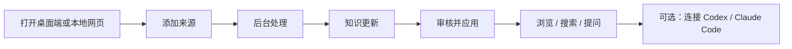

# MemoryForge 中文用户指南

这份指南按普通用户的实际使用顺序编写：先打开本地界面，再添加资料、审核更新、浏览知识，最后才介绍命令行和 AI 客户端接入。

MemoryForge 是一个本地优先的知识库。它不会把来源直接覆盖进 Wiki，而是固定保存来源快照，生成可审核的知识更新；只有你批准并应用后，页面才会进入正式 Wiki，搜索和 AI 才会把它当成已确认知识。



## 1. 先选一个入口

### 推荐：macOS 桌面端

桌面端把本地知识门户放进原生 macOS 窗口。日常使用时双击应用即可，不需要打开浏览器，也不会访问远程网页；关闭窗口后，本地 Portal 服务会自动停止。

当前仓库提供源码构建的桌面端。它的界面和网页端完全相同，使用同一个 Workspace：


### 备选：本地网页端

网页端适合不使用 macOS、临时查看知识库，或希望在浏览器中调试。它只监听 `127.0.0.1`，不是公网服务。

```bash
memoryforge start --workspace /absolute/path/to/my-wiki
```

命令会启动本地 Portal 并尝试打开浏览器。若浏览器没有自动打开，访问终端输出的 `http://127.0.0.1:<port>` 地址即可。按 `Ctrl+C` 停止服务。

### 高级：命令行

CLI 适合批量导入、自动化、CI、故障排查和没有图形界面的机器。它不是日常入门的必经路径；界面能完成的操作，优先在桌面端或网页端完成。

## 2. 第一次安装和创建知识库

### 2.1 从源码安装（桌面端和网页端都适用）

要求 Python 3.11 或更高版本。当前桌面端需要在 macOS 上构建。

```bash
git clone https://github.com/still0123/MemoryForge.git
cd MemoryForge

python3.11 -m venv .venv

# 只使用本地网页端：
.venv/bin/python -m pip install .

# 需要构建 macOS 桌面端：
.venv/bin/python -m pip install -e '.[desktop]'
```

如果只安装已经发布的 CLI，也可以使用：

```bash
python3.11 -m pip install memoryforge-wiki
```

发布包默认提供命令行能力；桌面端依赖和可双击应用目前按源码构建。

### 2.2 创建一次 Workspace

Workspace 就是你的本地知识库目录。首次启动桌面端之前，先创建它：

```bash
.venv/bin/memoryforge init /absolute/path/to/my-wiki
```

例如：

```bash
.venv/bin/memoryforge init ~/Documents/MemoryForge/my-wiki
```

当前桌面端首次打开时会让你选择一个**已经初始化的 Workspace**，不会在文件夹选择器里自动新建知识库。不要选择 MemoryForge 源码目录；如果看到“不是已初始化的 Workspace”，回到这里执行一次 `init`。

Workspace 的主要结构如下：

```text
my-wiki/
├── raw/                 # 不可变来源快照
├── wiki/
│   ├── INDEX.md         # Wiki 总目录
│   └── pages/           # 已应用的 Markdown 知识页
├── .memoryforge/        # SQLite 索引、任务、来源和待审核 ChangeSet
└── .git/                # Wiki 的本地版本历史
```

### 2.3 打开桌面端

构建可双击的应用：

```bash
./scripts/build_macos_app.sh
open dist/MemoryForge.app
```

之后直接双击 `dist/MemoryForge.app` 即可。首次启动选择刚才的 `my-wiki`；应用会记住最近一次选择，下次自动打开。

开发时也可以不打包：

```bash
.venv/bin/memoryforge desktop --workspace ~/Documents/MemoryForge/my-wiki
```

需要重新选择 Workspace 时：

```bash
.venv/bin/memoryforge desktop --choose-workspace
```

桌面端构建和签名细节见 [macOS 桌面端指南](DESKTOP_APP_CN.md)。

## 3. 用界面完成第一份知识入库

打开桌面端或网页端后，左侧导航通常按下面的顺序使用：

| 页面 | 用途 |
| --- | --- |
| **首页** | 查看已应用页面、项目、待审核更新和运行中任务 |
| **我的知识** | 按项目、AI 会话、飞书资料、文件和网页浏览正式知识 |
| **添加来源** | 选择代码、文件、网页、飞书或 AI 会话 |
| **知识更新** | 查看并处理待审核 ChangeSet |
| **后台任务** | 查看导入、编译、刷新和应用的进度与错误 |
| **系统状态** | 查看 Workspace、来源、索引和诊断状态 |

### 第一步：添加来源

进入 **添加来源**，选择来源类型。当前界面支持：

- 本地 Git 仓库；
- HTTPS Git 仓库链接；
- Codex AI 会话；
- 飞书文档或 Wiki 链接；
- Markdown、TXT 等本地文件；
- 本地文件夹；
- 公开网页；
- GitHub Issue 或 Pull Request 讨论。

输入路径或 URL 后先点击 **预览来源**。预览会显示标题、版本、分支、语言、来源类型和隐私边界；确认无误后点击 **开始处理**。

小型 Markdown/TXT 文件和 Codex JSONL 会话也可以直接通过文件选择器上传。Codex 会话始终按本地、未验证材料处理。

### 第二步：确认隐私

来源默认按 `local_only` 处理。只有明确允许发送到已配置模型的公开资料，才勾选“这是可公开资料”并完成二次确认。

建议遵守下面的默认策略：

| 来源 | 建议边界 |
| --- | --- |
| 公司代码、飞书、AI 会话、个人文件 | 保持本地 |
| 公开 GitHub 仓库、公开网页 | 确认无敏感内容后才标记为公开 |
| 不确定的资料 | 保持本地，后续仍可使用确定性编译 |

导入本身不会把资料发送给模型。只有显式启用模型整理，并且授权了本地来源时，命中的 `local_only` 内容才可能进入模型请求。

### 第三步：等待后台任务

提交后会进入 **后台任务**。任务可能依次经历：导入来源、扫描仓库、生成知识更新、生成代码 Wiki、校验结果等阶段。

常见状态：

- **等待**：任务已排队；
- **运行中**：正在导入、编译或刷新；
- **等待审核**：已经生成 ChangeSet，等待你处理；
- **完成**：任务结束且没有新的待审核更新；
- **失败**：点击任务查看错误信息；
- **已取消**：排队中的任务被取消。

任务完成后，点击 **查看知识更新** 进入审核页面。

## 4. 审核并应用知识更新

进入 **知识更新** 后，你会看到每次来源变化生成的待审核卡片。卡片会显示新增、修改、删除数量，以及涉及的来源数量。

打开卡片后：

1. 展开“涉及来源”，确认来源名称、版本和隐私边界；
2. 展开“知识页改动”，按页面查看 Diff 和 Citation 数量；
3. 确认内容后点击 **批准并应用**；
4. 如果内容不应进入正式 Wiki，点击 **拒绝**。


大批量更新默认只先加载摘要；展开具体来源或知识页时才加载详情，这样审核大量代码页时不会一次性卡住界面。

### 界面按钮和 CLI 的对应关系

在 Portal 中，**批准并应用**是一个连续操作：记录审核、批准 ChangeSet、写入正式 Wiki 并生成新的本地 Git Commit。使用 CLI 时则必须分开执行：

```bash
memoryforge review <changeset-id> --workspace "$MF_WORKSPACE"
memoryforge approve <changeset-id> --workspace "$MF_WORKSPACE"
memoryforge apply <changeset-id> --workspace "$MF_WORKSPACE"
```

任何来源更新都不会自动进入正式 Wiki；自动刷新也只会生成新的待审核更新。

## 5. 浏览、搜索和提问

### 浏览“我的知识”

进入 **我的知识** 后，可以从这些入口开始：

- **项目与代码**：项目概览、模块、文件、符号和关系；
- **AI 会话**：已审核的会话结论、决策和排查记录；
- **飞书资料**：从飞书文档整理的页面；
- **文件、网页和笔记**：本地资料与网页来源。

打开知识页后，可以阅读正文、页面摘要、来源 Citation 和关联知识。页面只展示已经应用的正式 Wiki，不会把待审核草稿混进查询结果。

### 全局搜索

顶栏搜索会查标题、路径和正文。按 `⌘K`（Windows/Linux 可用 `Ctrl+K`）聚焦搜索框，输入后按回车查看结果。

### 从 Wiki 提问

进入首页的 **提问**，或导航到 `#ask` 页面，在输入框中直接提问。Portal 的提问只读取已应用知识，并在结果下方展示对应 Citation。

回答证据状态遵循三种情况：

| 状态 | 含义 | AI 应该怎么说 |
| --- | --- | --- |
| `grounded` | 本地证据足以支持结论 | 可以作为项目事实回答，并附引用 |
| `partial` | 找到部分证据，但不能证明完整结论 | 只陈述已支持部分，明确未证实边界 |
| `no_local_evidence` | 本地 Wiki 没有证明该项目事实的证据 | 可以给通用分析，但不能伪装成项目事实或编造引用 |

这意味着“没有充分项目证据”不再等于“大模型什么都不能回答”。MemoryForge 负责证据边界，AI 负责组织答案；两者职责不同。

## 6. 导入代码仓库并生成 Code Wiki

这是使用 MemoryForge 管理项目知识的主要场景。优先在 Portal 中操作：

1. 进入 **添加来源**；
2. 选择 **本地 Git 仓库** 或 **Git 仓库链接（HTTPS）**；
3. 预览仓库后确认隐私；
4. 点击 **开始处理**，等待后台任务生成代码 Wiki；
5. 在 **知识更新** 中查看项目、模块、文件、符号和关系页面；
6. 点击 **批准并应用**。

建议第一次只导入一个较小的业务模块。当前动态 Portal 的代码索引支持 Go、Python、TypeScript 和 TSX；仓库最好先提交需要收录的代码，便于把知识绑定到固定 Commit。

### CLI 等价流程

当需要批量处理或脚本化时：

```bash
export MF_WORKSPACE=/absolute/path/to/my-wiki

memoryforge git-add /absolute/path/to/local-repository --workspace "$MF_WORKSPACE"
memoryforge git-list --workspace "$MF_WORKSPACE"
memoryforge code-add <repository-id> . --workspace "$MF_WORKSPACE"
memoryforge git-sync <repository-id> --workspace "$MF_WORKSPACE"
memoryforge ingest --code-wiki <repository-id> --workspace "$MF_WORKSPACE"
memoryforge changeset-list --workspace "$MF_WORKSPACE"
memoryforge review <changeset-id> --workspace "$MF_WORKSPACE"
memoryforge approve <changeset-id> --workspace "$MF_WORKSPACE"
memoryforge apply <changeset-id> --workspace "$MF_WORKSPACE"
memoryforge lint --workspace "$MF_WORKSPACE"
```

`git-sync` 读取已提交快照；未提交工作树不会成为正式 Code Wiki 来源。公开仓库只有在确认模型可以读取时才标记为公开，私有仓库保持本地。

## 7. 导入文件、网页、飞书和 GitHub 讨论

日常使用直接从 **添加来源** 页面选择类型。下面是每种来源的注意事项：

| 来源 | 在界面中填写 | 备注 |
| --- | --- | --- |
| 本地文件 | 文件路径或上传文件 | 支持 Markdown、Markdown 扩展名和 TXT |
| 文件夹 | 文件夹路径 | 递归处理支持的文本文件，不跟随符号链接 |
| 网页 | 公开 HTTP(S) URL | 只读取指定页面，不抓取整个站点 |
| GitHub 讨论 | Issue/PR URL | 导入公开讨论、Review 和 inline comments |
| 飞书文档 | 文档 URL 或 token | 需要先完成本机飞书授权 |

命令行入口仅在需要自动化时使用：

```bash
memoryforge import /absolute/path/to/note.md --workspace "$MF_WORKSPACE"
memoryforge folder-import /absolute/path/to/docs --workspace "$MF_WORKSPACE"
memoryforge web-import 'https://example.com/article' --workspace "$MF_WORKSPACE"
memoryforge github-thread-import 'https://github.com/owner/repo/issues/123' --workspace "$MF_WORKSPACE"
memoryforge feishu-import 'https://example.feishu.cn/wiki/<token>' --workspace "$MF_WORKSPACE"
```

这些命令只写入来源快照，之后仍要通过界面或 CLI 完成知识更新审核。

## 8. 收录 Codex AI 会话

### 在 Portal 中选择会话

进入 **添加来源**，选择 **AI 会话**，点击 **扫描未收录 Codex 会话**，从列表中选择需要保存的会话，预览后开始处理。

会话会被过滤为用户和 Assistant 的可读文本；system prompt、内部推理和工具输出不会作为普通知识正文导入。它始终是 `local_only`、未验证的记忆草稿，重要结论仍应回到代码或 Citation 核验。

### CLI 入口

```bash
memoryforge codex-import \
  ~/.codex/sessions/YYYY/MM/DD/rollout-<id>.jsonl \
  --title '排查缓存失效问题' \
  --workspace "$MF_WORKSPACE"
```

重复导入同一个 rollout 会更新同一来源，不会不断产生重复会话。不要让 MemoryForge 扫描浏览器 Profile、Cookie、账号缓存或应用私有数据库。

## 9. 刷新和自动更新

### 在界面中刷新

进入 **我的知识** 的来源管理页面，打开某个来源后点击刷新。刷新会创建后台任务；任务完成后到 **知识更新** 审核，不会静默修改正式 Wiki。

### CLI 或自动化

```bash
memoryforge refresh --workspace "$MF_WORKSPACE"
memoryforge watch --once --workspace "$MF_WORKSPACE"
memoryforge watch --interval 60 --workspace "$MF_WORKSPACE"
```

推荐维护节奏：

```text
来源更新
  → 刷新 / watch
  → 后台任务
  → 知识更新
  → 审核并应用
  → 搜索和提问
```

`watch` 只产生待审核 ChangeSet。它不会自动批准、自动应用或把未审核内容暴露给 AI。

## 10. 在 Codex 或 Claude Code 中按需使用知识库

推荐方式是只注册 MCP，不开启自动会话注入。这样 AI 可以在需要时查询正式 Wiki，也可以在你明确
选择后把某个旧会话主题加载进当前对话；普通新对话保持干净，不会自动继承上一次主题。

### 10.1 Codex：一次连接整个 Workspace

如果你主要在 Codex 中工作，可以把一个 Workspace 注册成全局只读 MCP Router。连接一次即可：

```bash
memoryforge connect codex --workspace "$MF_WORKSPACE"
```

完成后重启 Codex（或 ChatGPT Desktop / IDE 扩展），用 `/mcp` 确认 `memoryforge` 已出现。之后正常提问即可；当问题涉及已登记项目、历史决策、飞书资料或 Wiki 时，Codex 会按需调用 `memoryforge_context`。

默认连接还会移除该 Workspace 过去安装的 MemoryForge `SessionStart` Hook，并作废尚未消费的 Codex
Capsule；其他产品的 Hook 不会被删除。只有确实希望“下一次新任务自动加载”时，才显式开启：

```bash
memoryforge connect codex --startup-hook --workspace "$MF_WORKSPACE"
```

### 10.2 Claude Code CLI：功能适用，但接入命令不同

Claude Code CLI 支持同一个本地 stdio MCP Server。MemoryForge 会通过 Claude 官方 CLI 注册 user
scope 全局 Router，并安装个人级 `memoryforge-knowledge` Skill：

```bash
memoryforge connect claude --workspace "$MF_WORKSPACE"
```

如果需要让 Claude 读取 `local_only` 来源（AI 会话通常属于这一类），显式授权：

```bash
memoryforge connect claude --allow-local-llm --workspace "$MF_WORKSPACE"
```

这会扩大模型可见范围，应只在确认 Claude Code 可以接收这些资料时开启。

安装后在终端执行 `claude mcp list`，进入 Claude Code 后使用 `/mcp` 查看连接状态。卸载使用：

```bash
claude mcp remove --scope user memoryforge
```

Claude Code CLI 可以直接使用 `memoryforge_context`、`memoryforge_episodes`、
`memoryforge_load_session` 和 `memoryforge_read_evidence`。它与 Codex 共用相同的渐进式加载和证据协议。
默认连接不会创建 SessionStart Hook；个人 Skill 位于
`~/.claude/skills/memoryforge-knowledge/SKILL.md`，用于指导 Claude 按需调用工具。

Claude Code 官方参考：[MCP 接入](https://code.claude.com/docs/en/mcp)、
[Skills](https://code.claude.com/docs/en/slash-commands)、
[Hooks](https://code.claude.com/docs/en/hooks)。

### 10.3 在当前对话加载指定历史主题

Codex 和 Claude Code 中都可以先创建新对话，再直接说：

```text
列出我最近的 MemoryForge 主题
加载第 2 个主题
```

第一句只返回编号、主题和短摘要。第二句必须调用 `memoryforge_load_session`，并显示一份有字符上限的
详细摘要，例如核心结论、实现路径、调用链、相关文件和会话引用；不能只回复“已加载”。详细内容只
进入当前对话，不会自动出现在之后的新对话。

后续继续问该主题时，Host 应保留对应 `session_refs`，并使用
`memoryforge_load_session(session_refs, question=...)` 只取相关片段。如果返回
`no_session_evidence`，再用同一个问题调用 `memoryforge_context`，而不是把无关旧会话当成答案。

### 10.4 可选的下一任务自动注入

普通用户不需要这一模式。Claude Code 如果确实需要，可以显式开启：

```bash
memoryforge connect claude --startup-hook --workspace "$MF_WORKSPACE"
```

MemoryForge 只合并自己的条目，不会覆盖 `~/.claude/settings.json` 中的其他 Hook。随后使用
`memoryforge continue --to claude` 为指定目录准备一次性 Capsule。Claude Code 的 `SessionStart` 会在
新建、恢复和清空会话时运行，因此必须保持 Capsule 与目标目录严格绑定。再次运行不带
`--startup-hook` 的 `memoryforge connect claude` 可关闭该 Workspace 的自动注入。Claude Code 会把 Hook 返回的
`additionalContext` 放入模型上下文，通常不会把它显示成一条普通聊天消息。

### 10.5 查询结果和隐私边界

它不会把整个 Wiki 预先塞进每个对话，而是先返回少量页面和 Citation，需要时再读取一条原文 Evidence。当前 MCP 返回的主要字段包括：

- `project_answer`：来自本地证据的项目答案提示；
- `evidence_status`：`grounded`、`partial` 或 `no_local_evidence`；
- `verification_status`：区分已审核项目证据和未验证会话历史；
- `supported_claims` / `unsupported_aspects`：已支持和未支持的范围；
- `answer_strategy`：建议直接回答、验证当前代码，还是仅提供通用指导；
- `citations`：对应的 Wiki 页面、SourceVersion 和原文位置。

全局 Router 搜索整个已应用 Workspace。当前项目只影响排序优先级，不会把其他已登记仓库排除，因此跨仓库问题和没有当前项目的新对话也可以检索。

默认只向 AI Host 提供公开来源。如果确认 Codex 可以接收本地资料，再显式授权：

```bash
memoryforge connect codex --workspace "$MF_WORKSPACE" --allow-local-llm
```

这会扩大该 Workspace 的模型可见范围；不要为了省一步操作而默认开启。

## 11. CLI 高级参考

下面是命令行按功能整理的入口。命令行适合自动化，不是普通用户的第一步。

| 目的 | 命令 |
| --- | --- |
| 创建 / 检查知识库 | `init`、`status`、`doctor` |
| 管理来源 | `source-list`、`import`、`folder-import`、`web-import`、`feishu-import`、`github-thread-import`、`codex-import` |
| 管理 Git 仓库 | `git-add`、`git-list`、`git-sync`、`code-add` |
| 编译和审核 | `ingest`、`changeset-list`、`review`、`approve`、`apply`、`reject`、`lint` |
| 查询 | `search`、`ask`、`recall` |
| 连接 AI | `connect`、`mcp-config`、`agent` |
| 自动化 | `refresh`、`watch`、`automation-run` |
| 其他客户端 | `feishu-serve`、`botmux-hook`、`obsidian-build` |

最小的纯 CLI 流程如下：

```bash
export MF_WORKSPACE=/absolute/path/to/my-wiki
memoryforge import /absolute/path/to/note.md --workspace "$MF_WORKSPACE"
memoryforge ingest --pending --workspace "$MF_WORKSPACE"
memoryforge changeset-list --workspace "$MF_WORKSPACE"
memoryforge review <changeset-id> --workspace "$MF_WORKSPACE"
memoryforge approve <changeset-id> --workspace "$MF_WORKSPACE"
memoryforge apply <changeset-id> --workspace "$MF_WORKSPACE"
memoryforge search '关键词' --workspace "$MF_WORKSPACE"
memoryforge ask '这个项目为什么这样设计？' --workspace "$MF_WORKSPACE"
```

查看检索路径或展开 Citation 原文：

```bash
memoryforge ask '这个模块负责什么？' --debug --workspace "$MF_WORKSPACE"
memoryforge ask '这个模块负责什么？' --verify --workspace "$MF_WORKSPACE"
```

默认问答不需要模型。需要模型整理时，显式添加 `--llm`；如果命中本地来源，还要同时确认 `--allow-local-llm`。

## 12. 本地安全和隐私

- Portal 和桌面端只绑定 `127.0.0.1`，不会自动变成公网服务；
- 原始来源保存在 Workspace 的 `raw/` 中，正式页面保存在 `wiki/` 中；
- `local_only` 来源默认不会进入远程模型请求；
- 待审核 ChangeSet 不会进入搜索、提问或 MCP 正式回答；
- 重要事实应回到 Citation、SourceVersion 和原文位置核验；
- 不要把包含公司代码、飞书正文、真实会话、Token 或日志的 Workspace 提交到公开 GitHub；
- `--include-local` 只适合确认不会分享的静态导出目录。

静态 Showcase 适合公开 Demo 或固定快照，不适合日常管理知识库。日常请使用桌面端或动态 Portal。

## 13. 常见问题

### 双击桌面端后提示不是 Workspace

桌面端只能打开已执行过 `memoryforge init` 的目录。先初始化一个独立目录，再重新打开：

```bash
.venv/bin/memoryforge init ~/Documents/MemoryForge/my-wiki
.venv/bin/memoryforge desktop --choose-workspace
```

不要选择 MemoryForge 源码目录。

### 每次都要重新选择目录

正常情况下桌面端会记住最近一次 Workspace。如果需要换库，使用 `--choose-workspace` 重新选择；如果状态文件被清理，首次启动时再选择一次即可。

### 添加来源后看不到知识

来源进入的是后台任务，不会立即出现在正式 Wiki。依次检查：

1. **后台任务** 是否失败；
2. 是否已经进入 **知识更新**；
3. 是否点击了 **批准并应用**；
4. 回到 **我的知识** 或使用搜索查看已应用页面。

### 审核卡片点击后没有内容

审核页面会先加载摘要；“涉及来源”和“知识页改动”展开后才加载详情。等待加载完成后再展开具体页面。若任务仍处于运行中，先到 **后台任务** 查看进度或错误。

### 搜索有结果，但 AI 说没有证据

先确认搜索结果来自已应用页面，而不是待审核更新；再检查来源是否为 `local_only`。如果 AI Host 未获得本地资料授权，MemoryForge 会保留隐私边界。

### `recall` 返回 `empty`

这表示尚未应用会话 Wiki，不代表 MCP 或桌面端损坏。先在 **知识更新** 完成审核并应用，或者执行对应的 CLI 编译流程。

### 需要查看诊断信息

优先打开 **系统状态**。命令行可执行：

```bash
memoryforge status --workspace "$MF_WORKSPACE"
memoryforge doctor --workspace "$MF_WORKSPACE"
memoryforge lint --workspace "$MF_WORKSPACE"
```

## 14. 三个核心对象

### Source

一次不可变的来源快照，例如一个 Git Commit 下的代码、一份 Markdown、一篇飞书文档或一段 Codex 会话。来源更新时会创建新的 SourceVersion，不覆盖旧版本。

### ChangeSet

待审核的 Wiki 变更。它记录新增、修改、删除页面和对应 Citation。Portal 的 **知识更新** 页面就是 ChangeSet 的可视化审核入口。

### Wiki

已经批准并应用的 Markdown 知识。搜索、提问、MCP 和 `recall` 默认只把正式 Wiki 当成可查询入口。

因此，MemoryForge 的日常原则是：

```text
来源先保存
  → Wiki 再编译
  → 变更先审核
  → 回答回到证据
```

## 15. 推荐日常用法

### 第一次建立

```text
安装
  → init 一次 Workspace
  → 双击桌面端或启动本地网页
  → 添加来源并确认隐私
  → 等待后台任务
  → 知识更新：批准并应用
  → 我的知识：浏览、搜索、提问
```

### 每天或每周维护

```text
刷新来源 / 扫描新会话
  → 后台任务
  → 知识更新
  → 查看 Diff 和 Citation
  → 批准并应用
  → 在 Codex 中按需查询
```

### 只有在需要时才使用命令行

批量导入、定时刷新、CI、跨客户端配置和诊断再切换到 CLI。这样既保留 MemoryForge 的可审计性，也不会让第一次使用的人先学习一长串命令。

更多专题文档：

- [macOS 桌面端](DESKTOP_APP_CN.md)
- [全局 Codex MCP Router](GLOBAL_CODEX_MCP_ROUTER.md)
- [动态本地 Portal 设计](LOCAL_DYNAMIC_PORTAL_SPEC.md)
- [README 与公开演示](../README.md)
